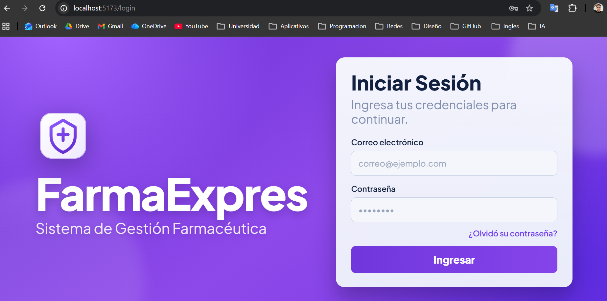
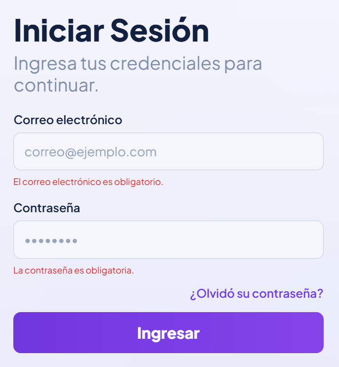
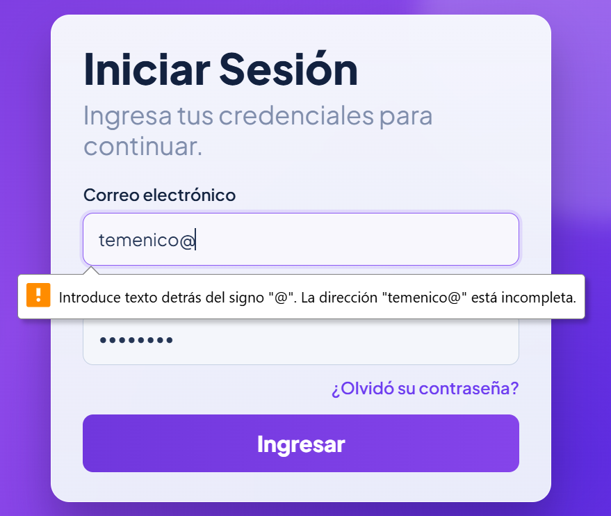
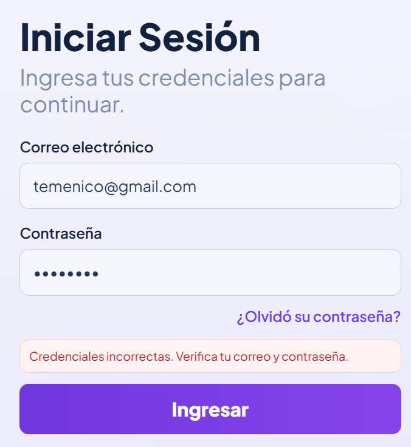
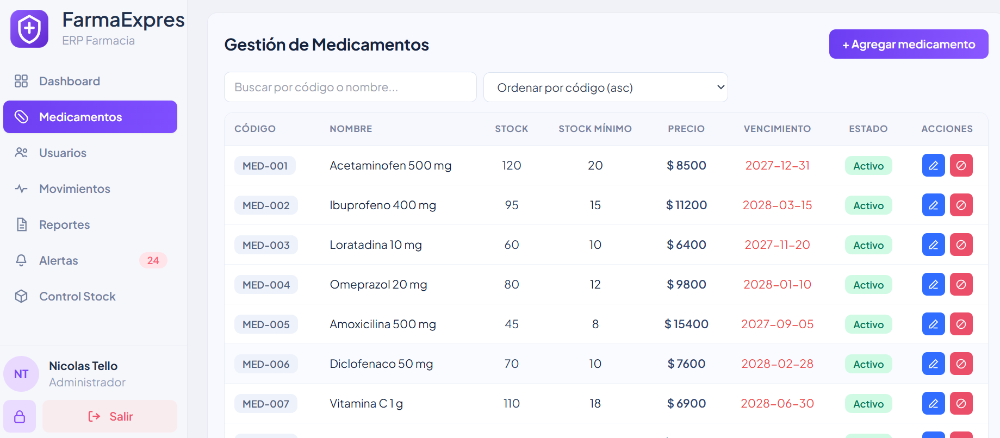
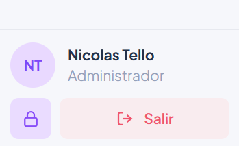
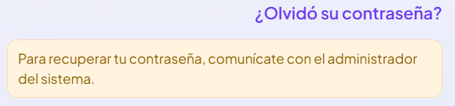

# HU-QA-FE-02 - Autenticación - Inicio de Sesión

## 1. Historia de Usuario

### 1.1 Identificación

- **Título:** Autenticación - Inicio de Sesión
- **ID:** HU-FE-02
- **Relacionado:** HU-RF-02 (Backend)
- **Prioridad:** Must Have (Alta)

### 1.2 Descripción

Como **usuario del sistema**,
quiero **iniciar sesión con mis credenciales desde la interfaz**,
para **acceder de forma segura a las funcionalidades del sistema según mi rol**.

### 1.3 Criterios de Aceptación

#### Interfaz

- [x] Se muestra pantalla de **inicio de sesión**.
- [x] Se visualiza campo **correo electrónico**.
- [x] Se visualiza campo **contraseña**.
- [x] Se visualiza botón **Iniciar sesión**.
- [x] Se visualiza opción **Recuperar contraseña**.

#### Validaciones

- [x] Campos obligatorios.
- [x] Validación de formato de correo.
- [x] No permite enviar formulario vacío.

#### Integración con Backend

- [x] Se realiza petición **POST /auth/login**.
- [x] Se envían `email` y `password`.

#### Respuesta del Sistema

**Éxito**

- [x] Se recibe token de autenticación.
- [x] Se guarda token en `localStorage`.
- [x] Se guarda información del usuario (rol).
- [x] Redirige a **medicines** (`/medicines`).

**Error**

- [x] Si credenciales incorrectas, muestra mensaje claro al usuario.
- [x] Maneja respuesta `403`.
- [x] Muestra error cuando falla el servidor.

#### Control de Acceso

- [x] Mantiene sesión activa mientras el token sea válido.
- [x] Protege rutas privadas.
- [x] Redirige al login si no hay token.

### 1.4 Checklist QA

- [x] No permite enviar campos vacíos.
- [x] Valida formato de correo.
- [x] Muestra error con credenciales incorrectas.
- [x] Guarda correctamente el token.
- [x] Redirige a medicines después del login.
- [x] Bloquea acceso a rutas sin autenticación.

### 1.5 Flujo de Usuario

1. El usuario accede a la pantalla de login.
2. Ingresa correo y contraseña.
3. Hace clic en **Iniciar sesión**.
4. El sistema valida credenciales.
5. Si son correctas, permite el ingreso.
6. Si son incorrectas, muestra mensaje de error.

---

## 2. Casos de Prueba QA

> Ruta de evidencias: `doc/images/HU-FE-02/`

### CP-HU-FE-02-01 - Render de pantalla de login

- **Objetivo:** Confirmar presencia de la pantalla de inicio de sesión.
- **Acción ejecutada:** Abrir aplicación sin sesión.
- **Resultado esperado:** Formulario visible con correo, contraseña, botón y opción de recuperación.
- **Evidencia:**

### CP-HU-FE-02-02 - Validación de campos obligatorios

- **Objetivo:** Validar que el formulario no envíe datos vacíos.
- **Acción ejecutada:** Clic en iniciar sesión sin completar campos.
- **Resultado esperado:** Mensajes de validación en campos obligatorios.
- **Evidencia:**

### CP-HU-FE-02-03 - Validación de formato de correo

- **Objetivo:** Verificar validación de correo.
- **Acción ejecutada:** Ingresar correo inválido y enviar.
- **Resultado esperado:** Mensaje de formato inválido.
- **Evidencia:**

### CP-HU-FE-02-04 - Credenciales incorrectas

- **Objetivo:** Validar manejo de error de autenticación.
- **Acción ejecutada:** Ingresar credenciales inválidas.
- **Resultado esperado:** Mensaje claro de error al usuario.
- **Evidencia:**

### CP-HU-FE-02-05 - Login exitoso

- **Objetivo:** Validar autenticación exitosa.
- **Acción ejecutada:** Ingresar credenciales válidas.
- **Resultado esperado:** Recepción de token y redirección a `/medicines`.
- **Evidencia:**

### CP-HU-FE-02-06 - Visualización de usuario autenticado

- **Objetivo:** Confirmar que se muestra el nombre y rol del usuario que inició sesión.
- **Acción ejecutada:** Iniciar sesión correctamente y revisar sidebar.
- **Resultado esperado:** Se visualizan nombre y rol del usuario autenticado.
- **Evidencia:**

### CP-HU-FE-02-07 - Mensaje de recuperación de contraseña

- **Objetivo:** Validar el mensaje informativo de recuperación.
- **Acción ejecutada:** Hacer clic en “¿Olvidó su contraseña?”.
- **Resultado esperado:** Se informa que debe contactar al administrador para recuperar acceso.
- **Evidencia:**

---

## 3. Conclusión

El documento queda alineado a la HU-FE-02 con foco en criterios funcionales, validación de acceso y evidencias QA requeridas para cierre.

## 4. Ajustes Complementarios (Fuera de HU)

- Se actualizó la integración frontend-backend para consumir endpoints en inglés y mantener compatibilidad de autenticación.
- Se normalizó el flujo de sesión (token + rol + nombre) para que el usuario autenticado se visualice en el sidebar.
- Se dejó consistente la navegación post-login hacia `/medicines` según el estado actual del módulo.
