# HU-QA-FE-04 - Registro de Medicamentos

## 1. Historia de Usuario

### 1.1 Identificacion

- **Titulo:** Gestion de Medicamentos - Registro
- **ID:** HU-FE-04
- **Relacionado:** HU-RF-04 (Backend)
- **Prioridad:** Must Have (Alta)

### 1.2 Descripcion

Como **administrador del sistema**,
quiero **registrar nuevos medicamentos desde la interfaz**,
para **mantener actualizado el inventario de la farmacia**.

Esta funcionalidad permite ingresar la informacion completa del medicamento, incluyendo su configuracion inicial de stock.

### 1.3 Criterios de Aceptacion

#### Interfaz

- [x] Existe un boton **Agregar medicamento**
- [x] Al hacer clic se abre un **modal o formulario**

#### Formulario

- [x] Campo **Codigo del medicamento** (obligatorio)
- [x] Campo **Nombre comercial** (obligatorio)
- [x] Campo **Stock inicial** (obligatorio)
- [x] Campo **Stock minimo** (obligatorio)
- [x] Campo **Precio unitario** (obligatorio)
- [x] Campo **Fecha de vencimiento** (obligatorio)

#### Validaciones

- [x] Todos los campos son obligatorios
- [x] El codigo no puede estar vacio
- [x] El stock debe ser un numero valido (>= 0)
- [x] El stock minimo debe ser un numero valido
- [x] El precio debe ser un numero valido
- [x] La fecha debe ser valida
- [x] No permite enviar formulario incompleto

#### Integracion con Backend

- [x] Se realiza peticion **POST /medicines**
- [x] Se envian: codigo, nombre, stock, stock minimo, precio, fecha de vencimiento
- [x] Se realiza peticion **POST /productos** (endpoint vigente en backend actual)

#### Respuesta del Sistema

**Exito:**

- [x] Se cierra el formulario
- [x] Se muestra mensaje: "Medicamento registrado correctamente"
- [x] Se actualiza la lista de medicamentos

**Error:**

- [x] Si el codigo ya existe: mostrar mensaje claro
- [x] Mostrar error si falla el servidor

#### Control de Acceso

- [x] Solo usuarios con rol **Administrador** pueden ver y usar esta funcionalidad
- [x] Usuarios con rol **Farmaceutico** o **Auditor** no pueden acceder

### 1.4 Checklist QA

- [x] No permite campos vacios
- [x] No permite valores negativos en stock
- [x] No permite precios invalidos
- [x] Muestra error si el codigo esta duplicado
- [x] Actualiza la tabla sin recargar la pagina
- [x] Respeta los roles de acceso

### 1.5 Notas Tecnicas

- La validacion de codigo duplicado depende del backend.
- El frontend solo muestra el mensaje de error.
- Incluir token en headers (Authorization Bearer).
- Consumir API mediante peticiones HTTP.

### 1.6 Flujo de Usuario

1. El administrador accede al modulo de medicamentos.
2. Hace clic en **Agregar medicamento**.
3. Completa el formulario.
4. Envia la informacion.
5. El sistema valida y registra.
6. Se muestra confirmacion.
7. El medicamento aparece en la lista.

---

## 2. Casos de Prueba Ejecutados (HU-FE-04)

> Ruta de evidencias: `doc/images/HU-FE-04/`

### CP-HU-FE-04-01 - Visualizacion del boton Agregar medicamento

- **Objetivo:** Verificar que la interfaz muestre el boton para iniciar el registro.
- **Accion ejecutada:** Se ingreso al modulo de medicamentos.
- **Resultado evidenciado:** El boton **+ Agregar medicamento** se muestra en la parte superior.
- **Comentario del caso:** Cumple el criterio de interfaz para habilitar el flujo de registro.
- **Evidencia:**

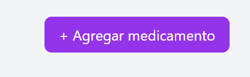

### CP-HU-FE-04-02 - Apertura de modal de registro

- **Objetivo:** Validar que el boton abra el formulario de registro.
- **Accion ejecutada:** Se hizo clic en **+ Agregar medicamento**.
- **Resultado evidenciado:** Se abre modal con los campos de captura.
- **Comentario del caso:** El flujo de apertura funciona correctamente.
- **Evidencia:**

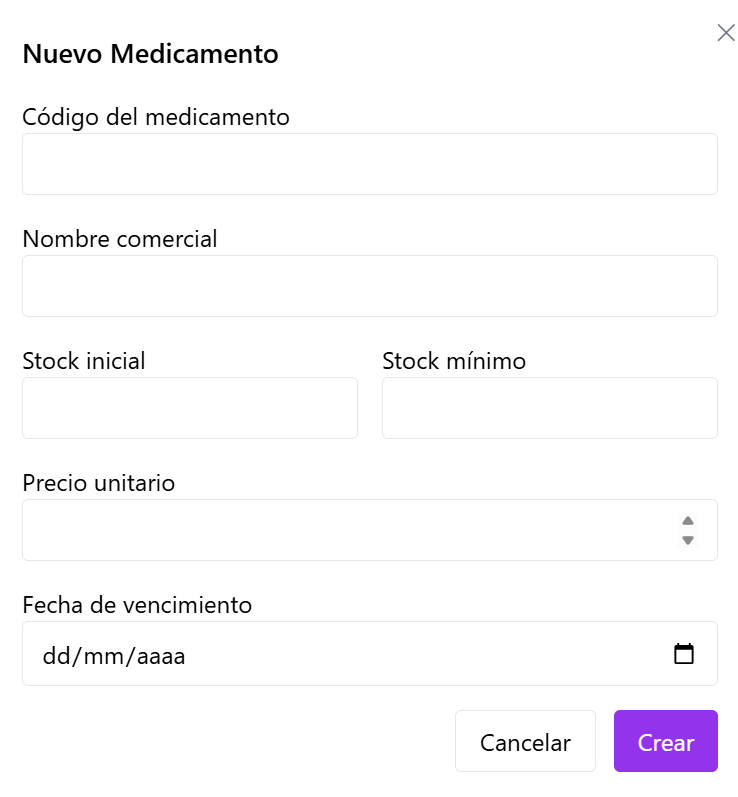

### CP-HU-FE-04-03 - Validacion de formulario incompleto

- **Objetivo:** Verificar que el sistema no permita enviar el formulario vacio.
- **Accion ejecutada:** Se intento crear el medicamento sin diligenciar campos.
- **Resultado evidenciado:** Se muestran mensajes de validacion y no se procesa envio.
- **Comentario del caso:** Cumple validacion de obligatoriedad general.
- **Evidencia:**

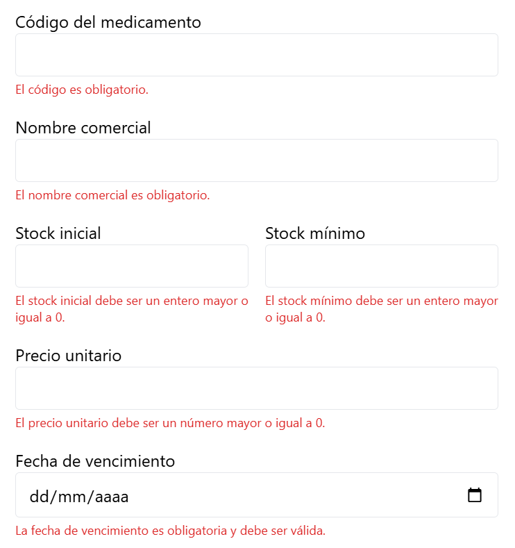

### CP-HU-FE-04-04 - Validacion de codigo vacio

- **Objetivo:** Confirmar que el codigo no puede estar vacio.
- **Accion ejecutada:** Se dejo vacio el campo codigo y se intento enviar.
- **Resultado evidenciado:** El sistema marca error en campo codigo.
- **Comentario del caso:** Se bloquea correctamente una entrada invalida clave.
- **Evidencia:**

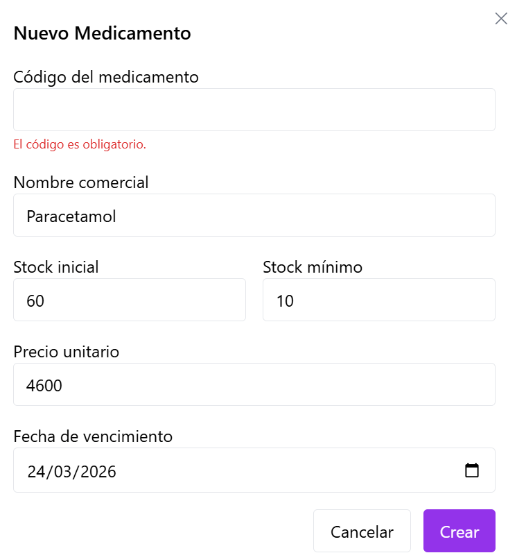

### CP-HU-FE-04-05 - Validacion de stock inicial negativo

- **Objetivo:** Validar regla de negocio de stock inicial >= 0.
- **Accion ejecutada:** Se ingreso un valor negativo en stock inicial.
- **Resultado evidenciado:** Se muestra mensaje de error y no se envia formulario.
- **Comentario del caso:** La validacion numerica evita datos inconsistentes.
- **Evidencia:**

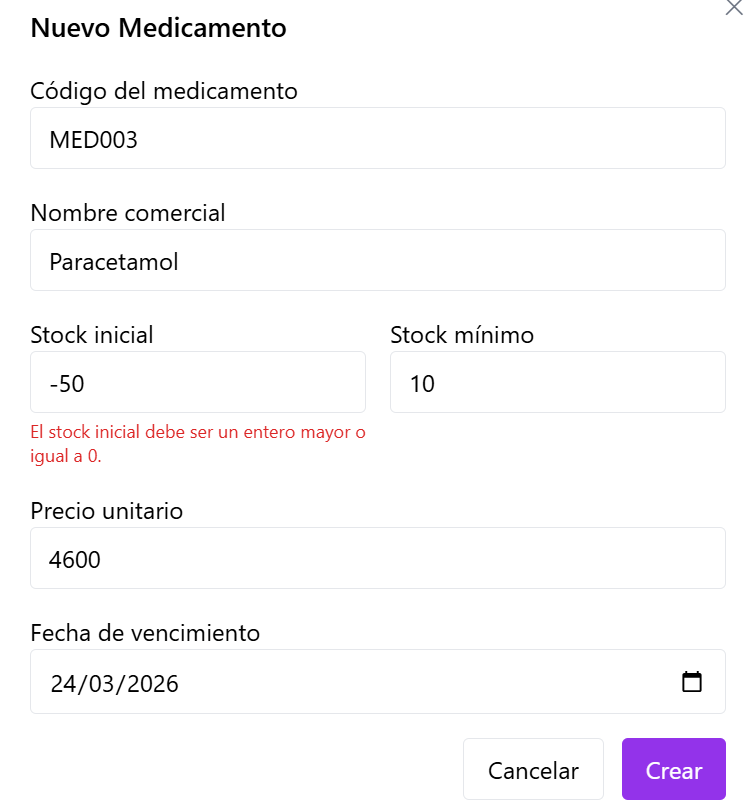

### CP-HU-FE-04-06 - Validacion de stock minimo negativo

- **Objetivo:** Verificar restriccion de stock minimo valido.
- **Accion ejecutada:** Se ingreso valor negativo en stock minimo.
- **Resultado evidenciado:** Se refleja error y se bloquea envio.
- **Comentario del caso:** La validacion protege el control futuro de alertas.
- **Evidencia:**

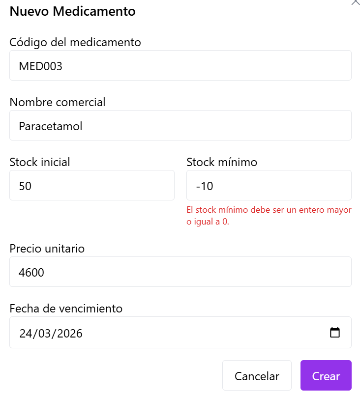

### CP-HU-FE-04-07 - Validacion de precio invalido

- **Objetivo:** Comprobar que el precio debe ser numerico y valido.
- **Accion ejecutada:** Se ingreso precio invalido y se intento registrar.
- **Resultado evidenciado:** El sistema marca error en precio.
- **Comentario del caso:** Cumple con validacion de formato de datos economicos.
- **Evidencia:**

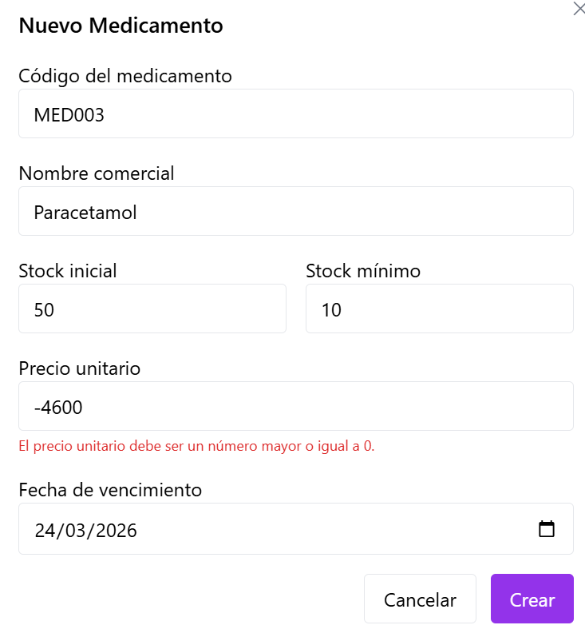

### CP-HU-FE-04-08 - Validacion de fecha invalida

- **Objetivo:** Validar que la fecha de vencimiento sea obligatoria y valida.
- **Accion ejecutada:** Se dejo fecha invalida/vacia en el formulario.
- **Resultado evidenciado:** El sistema muestra error de fecha.
- **Comentario del caso:** Se evita guardar registros incompletos para trazabilidad.
- **Evidencia:**

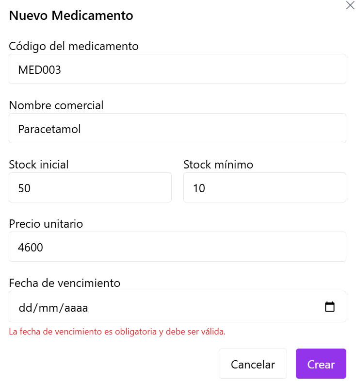

### CP-HU-FE-04-09 - Registro exitoso de medicamento

- **Objetivo:** Verificar el flujo exitoso de creacion.
- **Accion ejecutada:** Se diligenciaron datos validos y se envio formulario.
- **Resultado evidenciado:** Mensaje **Medicamento registrado correctamente** y cierre de modal.
- **Comentario del caso:** Confirma funcionamiento principal de la HU en escenario positivo.
- **Evidencia:**

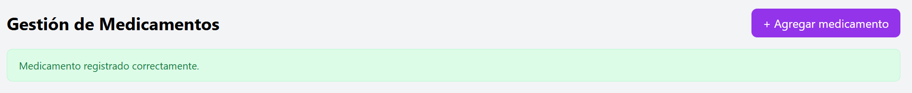

### CP-HU-FE-04-10 - Actualizacion de tabla sin recarga manual

- **Objetivo:** Comprobar refresco de listado en la misma vista.
- **Accion ejecutada:** Se registro un medicamento y se observo la tabla.
- **Resultado evidenciado:** El listado se actualiza sin recargar manualmente el navegador.
- **Comentario del caso:** Se cumple experiencia de usuario esperada para operacion continua.
- **Evidencia:**

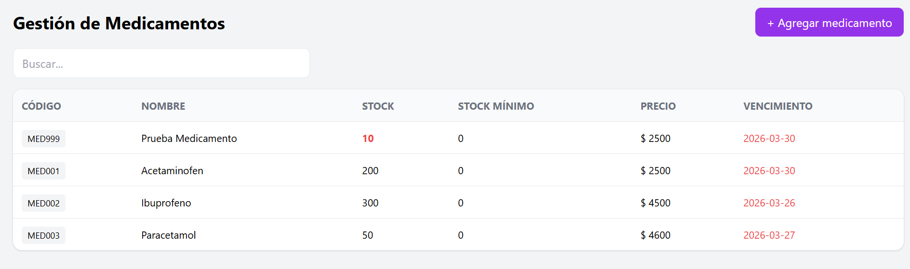

### CP-HU-FE-04-11 - Manejo de codigo duplicado

- **Objetivo:** Verificar mensaje claro cuando backend rechaza codigo repetido.
- **Accion ejecutada:** Se intento registrar medicamento con codigo existente.
- **Resultado evidenciado:** Se muestra mensaje de error por duplicidad de codigo.
- **Comentario del caso:** Cumple manejo de error funcional dependiente del backend.
- **Evidencia:**

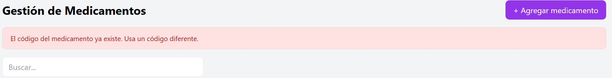

### CP-HU-FE-04-12 - Manejo de error de servidor

- **Objetivo:** Validar respuesta visual ante fallo tecnico del backend.
- **Accion ejecutada:** Se forzo escenario de error del servicio.
- **Resultado evidenciado:** La interfaz presenta mensaje de error al usuario.
- **Comentario del caso:** El sistema informa el fallo sin bloquear toda la vista.
- **Evidencia:**

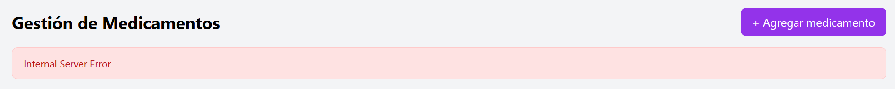

---

## 3. Conclusiones de Prueba

- La HU-FE-04 cuenta con evidencia visual para flujo de interfaz, validaciones, exito y errores.
- Se documenta cobertura funcional del registro de medicamentos en frontend.
- El control de acceso por rol queda pendiente hasta implementar login y autorizacion completa.
