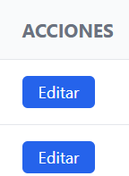
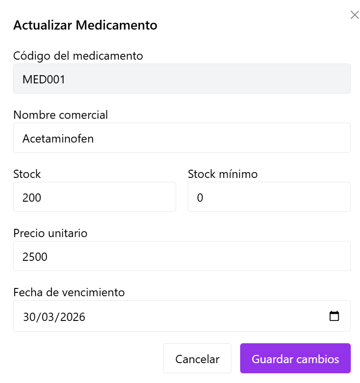
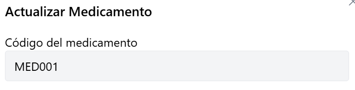
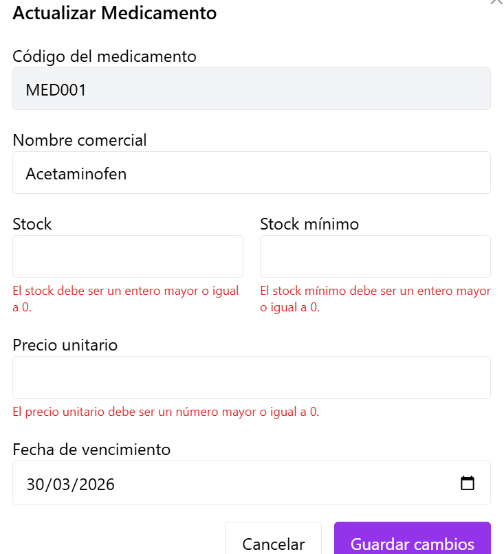
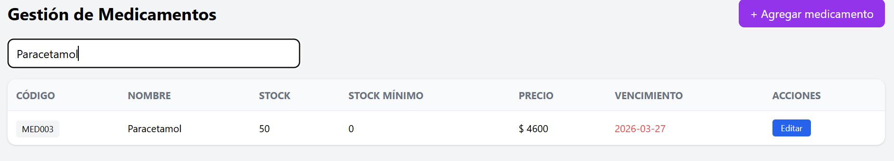

# HU-QA-FE-05 - Actualizacion de Medicamentos

## 1. Historia de Usuario

### 1.1 Identificacion

- **Titulo:** Gestion de Medicamentos - Actualizacion
- **ID:** HU-FE-05
- **Relacionado:** HU-RF-05 (Backend)
- **Prioridad:** Must Have (Alta)

### 1.2 Descripcion

Como **administrador del sistema**,
quiero **actualizar la informacion de un medicamento desde la interfaz**,
para **mantener los datos del inventario actualizados y correctos**.

### 1.3 Criterios de Aceptacion

#### Interfaz

- [x] En la tabla de medicamentos existe accion **Editar**
- [x] Al hacer clic se abre modal con datos precargados
- [x] Campo de busqueda funcional por **codigo** o **nombre** (mejora de usabilidad)

#### Formulario

- [x] Campo **Codigo del medicamento** visible y no editable
- [x] Campo **Nombre comercial** editable
- [x] Campo **Stock** editable
- [x] Campo **Stock minimo** editable
- [x] Campo **Precio unitario** editable
- [x] Campo **Fecha de vencimiento** editable

#### Validaciones

- [x] Campos obligatorios con validacion en frontend
- [x] El codigo no se puede modificar
- [x] Stock valido (entero >= 0)
- [x] Precio valido (numero >= 0)
- [x] Fecha valida de vencimiento

#### Integracion con Backend

- [x] Se realiza peticion **PUT /productos/{id}** (endpoint vigente en backend actual)
- [x] Se envian campos editables: nombre, stock, stock minimo, precio y fecha de vencimiento

#### Respuesta del Sistema

**Exito:**

- [x] Se cierra el formulario
- [x] Se muestra mensaje: "Medicamento actualizado correctamente."
- [x] Se actualiza la tabla sin recarga manual

**Error:**

- [x] Se muestra error claro si falla la actualizacion
- [x] Se muestra error claro si el medicamento no existe

#### Control de Acceso

- [ ] Solo usuarios con rol **Administrador** pueden editar medicamentos
- [ ] Usuarios con rol **Farmaceutico** o **Auditor** no pueden acceder

### 1.4 Checklist QA

- [x] El codigo no es editable
- [x] Los datos se cargan en el formulario de edicion
- [x] No permite valores invalidos
- [x] Guarda cambios y muestra confirmacion
- [x] Actualiza tabla sin recargar la pagina
- [ ] Respeta roles de acceso (pendiente de modulo auth/roles en frontend)

### 1.5 Notas Tecnicas

- El identificador del medicamento se toma desde `id` del registro.
- El codigo no se envia en el `PUT` para evitar cambios de identificador funcional.
- Se conserva manejo de token via `Authorization: Bearer`.
- Se mantiene consumo sobre endpoint de backend actual: `/productos/{id}`.
- Se implementa filtro local en frontend por `codigo` y `nombre`, sin cambios de contrato backend.
- **Pendiente backend:** en la revision de `inventory-service`, el metodo de actualizacion actualmente persiste `nombre`, `stock` y `precio`; `fechavencimiento` y `stockMinimo` dependen de ajustes del servicio backend para persistirlos completamente.

### 1.6 Flujo de Usuario

1. El administrador entra al modulo de medicamentos.
2. Visualiza lista y hace clic en **Editar**.
3. El sistema abre modal con datos precargados.
4. Modifica datos permitidos y guarda cambios.
5. El sistema valida, actualiza y confirma resultado.
6. La tabla refleja los cambios sin recargar la pagina.

---

## 2. Casos de Prueba Ejecutados (HU-FE-05)

> Ruta de evidencias: `doc/images/HU-FE-05/`

### CP-HU-FE-05-01 - Visualizacion de accion Editar

- **Objetivo:** Verificar que cada fila tenga accion de edicion.
- **Accion ejecutada:** Se ingreso al modulo de medicamentos y se reviso tabla.
- **Resultado evidenciado:** Se muestra boton **Editar** por registro.
- **Comentario del caso:** Permite iniciar flujo de actualizacion.
- **Evidencia:**

### CP-HU-FE-05-02 - Apertura de modal con datos precargados

- **Objetivo:** Confirmar precarga de informacion al editar.
- **Accion ejecutada:** Se hizo clic en **Editar** sobre un medicamento existente.
- **Resultado evidenciado:** Se abre modal con valores actuales.
- **Comentario del caso:** Se reduce riesgo de errores por digitacion.
- **Evidencia:**

### CP-HU-FE-05-03 - Codigo no editable

- **Objetivo:** Verificar que el codigo no pueda ser modificado.
- **Accion ejecutada:** Se intento editar campo codigo.
- **Resultado evidenciado:** Campo bloqueado (solo lectura).
- **Comentario del caso:** Cumple regla de negocio sobre identificador funcional.
- **Evidencia:**

### CP-HU-FE-05-04 - Validaciones de campos invalidos

- **Objetivo:** Validar bloqueo de envio con datos invalidos.
- **Accion ejecutada:** Se ingresaron stock/precio invalidos y fecha invalida.
- **Resultado evidenciado:** Se muestran mensajes de error y no se envia formulario.
- **Comentario del caso:** Se protege integridad de datos desde frontend.
- **Evidencia:**

### CP-HU-FE-05-05 - Actualizacion exitosa

- **Objetivo:** Verificar flujo positivo de actualizacion.
- **Accion ejecutada:** Se modificaron datos validos y se guardaron cambios.
- **Resultado evidenciado:** Mensaje de exito, cierre de modal y refresco de tabla.
- **Comentario del caso:** Flujo principal de la HU funcional.
- **Evidencia:**

### CP-HU-FE-05-06 - Busqueda por codigo o nombre

- **Objetivo:** Validar busqueda local en la tabla de medicamentos.
- **Accion ejecutada:** Se ingreso texto por codigo y nombre en el campo de busqueda.
- **Resultado evidenciado:** La tabla filtra registros coincidentes en tiempo real.
- **Comentario del caso:** Mejora la ubicacion rapida de medicamentos sin recargar la vista.
- **Evidencia:**

---

## 3. Conclusiones de Prueba

- La HU-FE-05 queda implementada en frontend con flujo de actualizacion completo.
- Se mantiene coherencia con reglas de validacion y feedback de HU-FE-04.
- Se incluye mejora de usabilidad con busqueda local por codigo y nombre.
- La restriccion formal por roles queda pendiente hasta consolidar autenticacion/autorizacion en frontend.
- Los escenarios de error tecnico y recurso no existente quedan como validacion pendiente para ejecucion posterior de QA.
