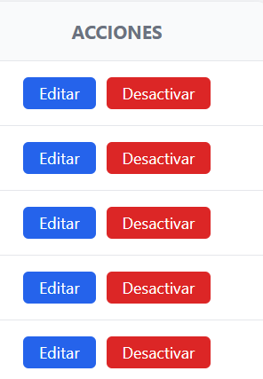
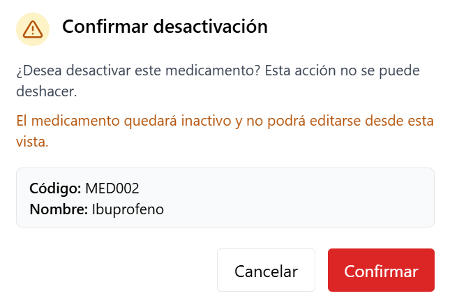
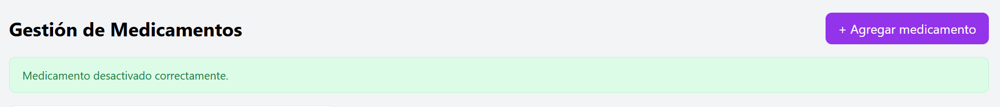
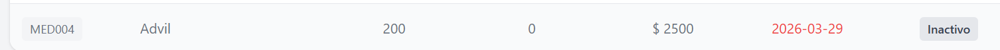
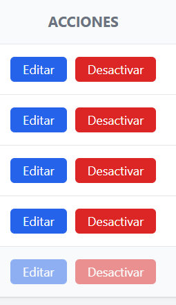

# HU-QA-FE-06 - Eliminacion Logica de Medicamentos

## 1. Historia de Usuario

### 1.1 Identificacion

- **Titulo:** Gestion de Medicamentos - Eliminacion Logica
- **ID:** HU-FE-06
- **Relacionado:** HU-RF-06 (Backend)
- **Prioridad:** Must Have (Alta)

### 1.2 Descripcion

Como **administrador del sistema**,
quiero **desactivar un medicamento desde la interfaz**,
para **evitar su uso en el sistema sin eliminar su historial**.

### 1.3 Criterios de Aceptacion

#### Interfaz

- [x] En la tabla de medicamentos existe accion **Desactivar**
- [x] Al hacer clic se muestra mensaje de confirmacion

#### Confirmacion

- [x] Se muestra mensaje: "¿Desea desactivar este medicamento?"
- [x] Se permite confirmar o cancelar la accion
- [x] La confirmacion se presenta en modal visual de interfaz

#### Integracion con Backend

- [x] Se realiza peticion **DELETE /productos/{id}** (endpoint vigente en backend actual)
- [x] Se envia el identificador del medicamento

#### Respuesta del Sistema

**Exito:**

- [x] Se muestra mensaje: "Medicamento desactivado correctamente."
- [x] El medicamento cambia visualmente a estado **inactivo**
- [x] Se actualiza la tabla sin recarga manual

**Error:**

- [x] Se muestra error si falla la operacion
- [x] Se muestra error si el medicamento no existe

#### Control de Acceso

- [ ] Solo usuarios con rol **Administrador** pueden desactivar medicamentos
- [ ] Usuarios con rol **Farmaceutico** o **Auditor** no pueden acceder

#### Restricciones del Sistema

- [x] Un medicamento inactivo no puede ser editado desde frontend
- [ ] Un medicamento inactivo no puede usarse en movimientos (pendiente modulo movimientos)
- [x] Un medicamento inactivo se muestra visualmente como **Inactivo**

### 1.4 Checklist QA

- [x] Muestra confirmacion antes de desactivar
- [ ] Solo admin puede ejecutar la accion (pendiente auth/roles en frontend)
- [x] El estado cambia correctamente a inactivo
- [x] El medicamento no desaparece (sigue visible)
- [x] Se bloquean acciones de edicion y desactivacion sobre medicamentos inactivos
- [x] Maneja errores del backend correctamente

### 1.5 Notas Tecnicas

- No se elimina el registro en base de datos; se usa desactivacion logica por estado.
- Se consume endpoint `DELETE /productos/{id}`.
- Se mantiene uso de token en headers `Authorization: Bearer`.
- Se agrego columna de estado para distinguir medicamentos activos/inactivos.
- **Pendiente backend:** restriccion completa de uso en movimientos para productos inactivos.

### 1.6 Flujo de Usuario

1. El administrador accede al modulo de medicamentos.
2. Visualiza la lista y selecciona un registro activo.
3. Hace clic en **Desactivar**.
4. El sistema solicita confirmacion.
5. Al confirmar, se ejecuta desactivacion logica.
6. El sistema muestra mensaje y actualiza la tabla.
7. El medicamento queda visible con estado **Inactivo**.

---

## 2. Casos de Prueba Ejecutados (HU-FE-06)

> Ruta de evidencias: `doc/images/HU-FE-06/`

### CP-HU-FE-06-01 - Visualizacion de accion Desactivar

- **Objetivo:** Verificar que exista accion de desactivacion por registro.
- **Accion ejecutada:** Se ingreso al modulo de medicamentos y se reviso tabla.
- **Resultado evidenciado:** Se muestra boton **Desactivar** en filas activas.
- **Comentario del caso:** Cumple criterio de interfaz para iniciar flujo de eliminacion logica.
- **Evidencia:**

### CP-HU-FE-06-02 - Confirmacion previa de desactivacion

- **Objetivo:** Validar confirmacion antes de ejecutar accion irreversible en UI.
- **Accion ejecutada:** Se hizo clic en **Desactivar** sobre un medicamento activo.
- **Resultado evidenciado:** Se muestra mensaje de confirmacion con opciones confirmar/cancelar.
- **Comentario del caso:** Protege al usuario de ejecuciones accidentales.
- **Evidencia:**

### CP-HU-FE-06-03 - Desactivacion exitosa

- **Objetivo:** Verificar flujo exitoso de eliminacion logica.
- **Accion ejecutada:** Se confirmo desactivacion de un medicamento activo.
- **Resultado evidenciado:** Se muestra mensaje de exito y la tabla se actualiza.
- **Comentario del caso:** La accion se ejecuta sin recarga manual.
- **Evidencia:**

### CP-HU-FE-06-04 - Estado visual inactivo

- **Objetivo:** Confirmar representacion visual del estado inactivo.
- **Accion ejecutada:** Se reviso la fila del medicamento desactivado.
- **Resultado evidenciado:** El registro sigue visible y muestra estado **Inactivo**.
- **Comentario del caso:** Se conserva trazabilidad sin eliminar historial en interfaz.
- **Evidencia:**

### CP-HU-FE-06-05 - Bloqueo de acciones en medicamento inactivo

- **Objetivo:** Validar que no se permita editar/desactivar un registro inactivo.
- **Accion ejecutada:** Se intento usar botones de acciones sobre medicamento inactivo.
- **Resultado evidenciado:** Botones deshabilitados para edicion y desactivacion.
- **Comentario del caso:** Cumple restriccion funcional definida para frontend.
- **Evidencia:**

---

## 3. Conclusiones de Prueba

- La HU-FE-06 queda implementada en frontend con desactivacion logica y confirmacion previa.
- Se mantiene trazabilidad visual del medicamento al no removerlo de la tabla.
- El control formal por roles y la restriccion de uso en movimientos dependen de HU futuras de autenticacion y movimientos.
- La validacion de escenarios de error tecnico queda como pendiente para ejecucion posterior de QA.
