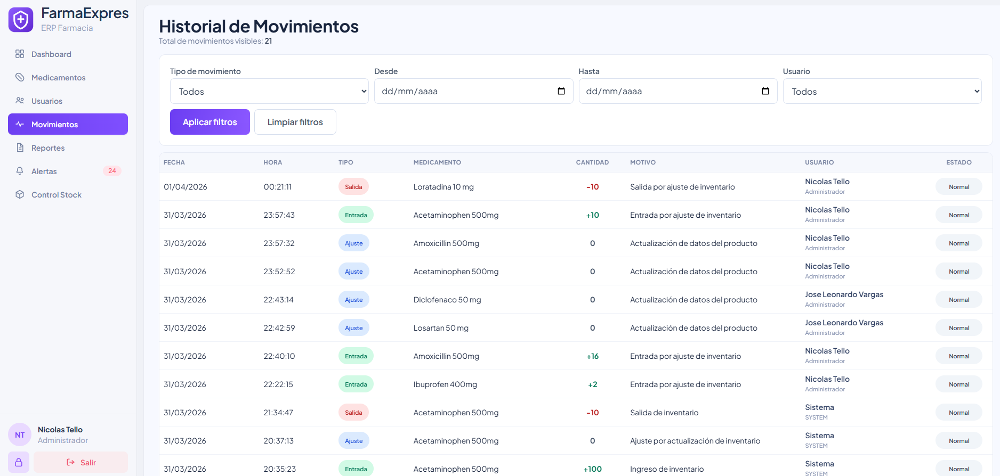
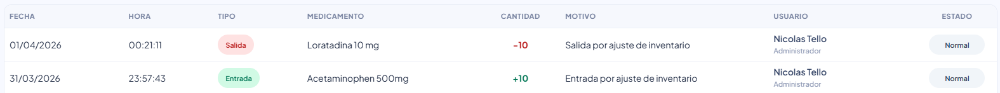
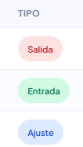
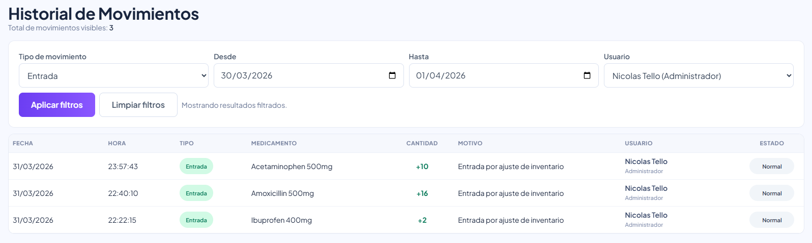
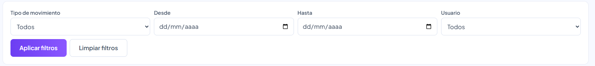
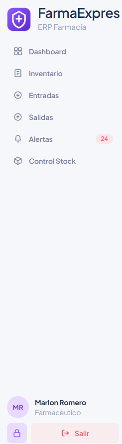
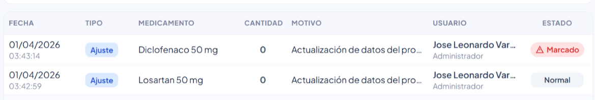
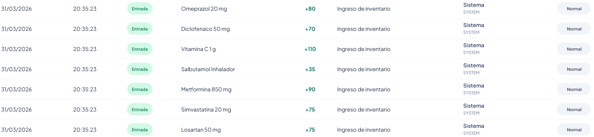
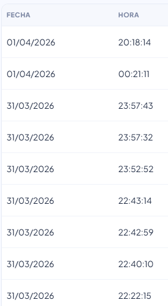

# HU-QA-FE-07 - Movimientos - Historial de Inventario

## 1. Historia de Usuario

### 1.1 Identificación

- **Título:** Movimientos - Historial de Inventario
- **ID:** HU-FE-07
- **Relacionado:** HU-RF-07 (Backend)
- **Prioridad:** Must Have (Alta)

### 1.2 Descripción

Como **administrador o auditor del sistema**,
quiero **consultar el historial de movimientos desde la interfaz**,
para **tener un registro claro y detallado de las acciones realizadas en el inventario**.

### 1.3 Criterios de Aceptación

#### Interfaz

- [x] Existe vista **Historial de Movimientos**.
- [x] Se muestra tabla de registros.
- [x] Se muestra cantidad total de movimientos visibles.

#### Información mostrada

- [x] Fecha.
- [x] Hora.
- [x] Tipo de movimiento con visual diferenciada:
  - Entrada (verde).
  - Salida (rojo).
- [x] Medicamento.
- [x] Cantidad:
  - Positiva para entradas.
  - Negativa para salidas.
- [x] Motivo del movimiento.
- [x] Usuario.
- [x] Estado:
  - Normal.
  - Marcado.

#### Filtros

- [x] Filtro por tipo de movimiento.
- [x] Filtro por rango de fechas (Desde / Hasta).
- [x] Filtro por usuario.
- [x] Botón **Limpiar filtros**.

#### Integración con Backend

- [x] Se realiza petición de consulta de movimientos con prioridad sobre `GET /movements`.
- [x] Se envían parámetros de filtro cuando aplica (`type`, `fromDate`, `toDate`, `user`).
- [x] Se incluye token en headers (`Authorization: Bearer`).

#### Respuesta del Sistema

**Éxito:**

- [x] Se muestran registros correctamente.
- [x] Se actualiza la tabla al aplicar filtros.

**Error:**

- [x] Se muestra mensaje de error si falla la carga.

#### Control de Acceso

- [x] Rol **Administrador** puede acceder.
- [x] Rol **Auditor** puede acceder.
- [x] Otros roles no pueden visualizar la vista de movimientos.

#### Restricciones

- [x] Los registros no pueden ser editados.
- [x] Los registros no pueden ser eliminados.

### 1.4 Checklist QA

- [x] Muestra correctamente todos los campos.
- [x] Diferencia visual entre entrada y salida.
- [x] Muestra correctamente cantidades positivas y negativas.
- [x] Aplica filtros correctamente.
- [x] Botón limpiar funciona correctamente.
- [x] No permite modificar registros.
- [x] Respeta control de acceso.

### 1.5 Notas Técnicas

- Se implementó módulo nuevo `movements` en frontend con:
  - página de historial,
  - tabla de visualización,
  - servicio de consulta con normalización de contrato.
- El frontend prioriza consumo en `/api/movements` y agrega compatibilidad con variantes de endpoint detectadas en backend actual (`/movements`, `/api/motions`, `/api/Motion`).
- Se mantiene arquitectura modular y consumo vía capa de servicios compartida.
- Se aplican filtros tanto por query params (backend) como validación local (frontend) para robustez.

### 1.6 Flujo de Usuario

1. El usuario administrador o auditor accede al módulo **Movimientos**.
2. Visualiza el historial de inventario en tabla.
3. Diligencia filtros por tipo, fechas o usuario.
4. Aplica filtros y revisa resultados.
5. Limpia filtros para volver al estado general.

---

## 2. Casos de Prueba Ejecutados (HU-FE-07)

> Ruta de evidencias: `doc/images/HU-FE-07/`

### CP-HU-FE-07-01 - Acceso y visualización de historial

- **Objetivo:** Validar que admin/auditor puedan acceder a la vista de movimientos.
- **Acción ejecutada:** Navegar desde sidebar al módulo **Movimientos**.
- **Resultado evidenciado:** Se renderiza pantalla "Historial de Movimientos" con tabla y total visible.
- **Comentario del caso:** Se confirma disponibilidad de la vista funcional para consulta.
- **Evidencia:**

### CP-HU-FE-07-02 - Render de campos obligatorios

- **Objetivo:** Verificar columnas y datos requeridos por HU.
- **Acción ejecutada:** Revisar registros cargados.
- **Resultado evidenciado:** Se muestran fecha, hora, tipo, medicamento, cantidad, motivo, usuario y estado.
- **Comentario del caso:** La tabla cumple estructura completa de trazabilidad.
- **Evidencia:**

### CP-HU-FE-07-03 - Diferenciación visual Entrada/Salida

- **Objetivo:** Confirmar señal visual para tipo de movimiento.
- **Acción ejecutada:** Revisar badges de tipo y cantidades.
- **Resultado evidenciado:** Entrada en verde y Salida en rojo, con signo positivo/negativo correcto.
- **Comentario del caso:** Se facilita lectura rápida de impacto en inventario.
- **Evidencia:**

### CP-HU-FE-07-04 - Filtros por tipo, fechas y usuario

- **Objetivo:** Validar funcionamiento de filtros y actualización de tabla.
- **Acción ejecutada:** Aplicar distintos valores y confirmar cambios en resultados.
- **Resultado evidenciado:** La tabla refleja criterios de tipo, rango de fechas y usuario.
- **Comentario del caso:** La consulta permite análisis focalizado de movimientos.
- **Evidencia:**

### CP-HU-FE-07-05 - Limpiar filtros

- **Objetivo:** Verificar retorno al estado general.
- **Acción ejecutada:** Usar botón **Limpiar filtros** tras aplicar filtros.
- **Resultado evidenciado:** Se restablecen valores por defecto y listado completo.
- **Comentario del caso:** El flujo permite volver rápidamente al histórico global.
- **Evidencia:**

### CP-HU-FE-07-06 - Restricción de acceso por rol

- **Objetivo:** Validar bloqueo para roles no permitidos.
- **Acción ejecutada:** Intentar acceso a `/movements` con rol no autorizado.
- **Resultado evidenciado:** Se restringe visualización del módulo a roles autorizados.
- **Comentario del caso:** Se respeta control de acceso funcional definido para la HU.
- **Evidencia:**

### CP-HU-FE-07-07 - Visualización de estado Marcado

- **Objetivo:** Verificar render de estado marcado en la tabla de movimientos.
- **Acción ejecutada:** Revisar registro con estado **Marcado**.
- **Resultado evidenciado:** Se muestra badge diferenciado para estado marcado.
- **Comentario del caso:** Queda preparada la visualización para integración con módulo de auditoría.
- **Evidencia:**

### CP-HU-FE-07-08 - Normalización de usuario técnico del sistema

- **Objetivo:** Validar que registros automáticos no muestren identificador técnico crudo.
- **Acción ejecutada:** Revisar movimientos creados por procesos automáticos.
- **Resultado evidenciado:** Se visualiza nombre amigable de sistema.
- **Comentario del caso:** Mejora comprensión operativa para usuario final.
- **Evidencia:**

### CP-HU-FE-07-09 - Consistencia de fecha/hora en zona local

- **Objetivo:** Validar coherencia temporal en registros recientes.
- **Acción ejecutada:** Comparar movimientos recientes con hora local del cliente.
- **Resultado evidenciado:** Fecha/hora mostrada coincide con zona local del equipo.
- **Comentario del caso:** Se confirma comportamiento esperado para despliegue internacional.
- **Evidencia:**

---

## 3. Conclusiones de Prueba

- La HU-FE-07 queda validada en frontend con evidencia funcional de interfaz, filtros y trazabilidad.
- Se confirma control de acceso para roles permitidos y restricción para roles no autorizados.
- Se valida visualización de estados **Normal/Marcado** y normalización de usuario del sistema.
- Se verifica consistencia de fecha/hora en operación local, alineada con lineamientos de internacionalización.
