# HU-QA-FE-08 - Reportes del Sistema

## 1. Historia de Usuario

### 1.1 Identificación

- **Título:** Inventario (Control Inteligente de Stock) - Reportes del Sistema
- **ID:** HU-FE-08
- **Relacionado:** HU-RF-08 (Backend)
- **Prioridad:** Must Have (Alta)

### 1.2 Descripción

Como **administrador o auditor del sistema**,
quiero **visualizar reportes de inventario desde un panel centralizado**,
para **identificar estado de stock, movimientos, vencimientos y actividad por usuario de forma rápida**.

### 1.3 Criterios de Aceptación

#### Interfaz

- [x] Existe la vista **Reportes del Sistema**.
- [x] Existen pestañas: **Inventario Actual**, **Movimientos**, **Próximos a Vencer**, **Bajo Stock**, **Por Usuario**.
- [x] La pestaña activa se conserva al navegar fuera y volver a Reportes.

#### Indicadores y tablas

- [x] Cada sección muestra indicadores principales y tabla de detalle.
- [x] Se aplican estilos visuales consistentes por estado/prioridad.
- [x] Se respeta paginación y selector de filas en tablas.

#### Exportación

- [x] Se permite exportación por sección en formato **Excel (.xlsx)**.
- [x] El archivo exportado incluye encabezados, formato y columnas acordes a cada reporte.
- [x] En Inventario Actual se incluye total general.
- [x] En Movimientos se incluye motivo y detalle de ajuste.
- [x] En Próximos a Vencer, Bajo Stock y Por Usuario se exportan sus columnas específicas.

#### Integración con Backend

- [x] El frontend consume datos reales de backend para cada sección de reportes.
- [x] Se envía token en headers (`Authorization: Bearer`) para consultas protegidas.
- [x] Cuando el token expira, se redirige al login.

#### Control de Acceso

- [x] Rol **Administrador** puede acceder a Reportes.
- [x] Rol **Auditor** puede acceder a Reportes.
- [x] Otros roles no autorizados no acceden al módulo.

### 1.4 Checklist QA (Frontend + Backend)

- [x] Carga correcta de datos en las 5 pestañas con backend activo.
- [x] Persistencia de pestaña activa al cambiar de módulo y volver.
- [x] Persistencia de filtros en Movimientos al salir y regresar.
- [x] Exportación Excel correcta por cada pestaña.
- [x] Formato visual y columnas correctas en Excel (incluye totales donde aplica).
- [x] Redirección automática a login al expirar token.
- [x] Acceso correcto por rol (Administrador/Auditor) y restricción para no autorizados.

### 1.5 Notas Técnicas

- Se consolidó la experiencia del módulo de reportes en 5 secciones con diseño homogéneo.
- Se modularizó la exportación Excel por sección para mantener mantenibilidad.
- Se implementó persistencia de estado UI (pestaña activa y filtros de movimientos).
- Se reforzó el manejo de sesión para redirección inmediata al login ante token inválido/expirado.

### 1.6 Flujo de Usuario

1. El usuario (Administrador/Auditor) entra a **Reportes**.
2. Navega entre pestañas según necesidad operativa.
3. Aplica filtros (especialmente en Movimientos).
4. Consulta indicadores y detalle tabular.
5. Exporta el reporte de la pestaña actual en Excel.
6. Si la sesión expira, el sistema redirige a inicio de sesión.

---

## 2. Casos de Prueba Ejecutados (HU-FE-08)

> Ruta de evidencias: `doc/images/HU-FE-08/`

### CP-HU-FE-08-01 - Acceso al módulo Reportes (Administrador)

- **Objetivo:** Validar acceso del rol Administrador.
- **Acción ejecutada:** Iniciar sesión como admin y abrir Reportes.
- **Resultado evidenciado:** Visualiza módulo completo.
- **Evidencia:**

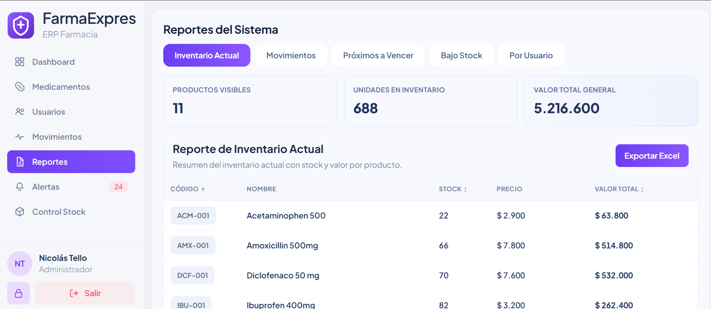

### CP-HU-FE-08-02 - Acceso al módulo Reportes (Auditor)

- **Objetivo:** Validar acceso del rol Auditor.
- **Acción ejecutada:** Iniciar sesión como auditor y abrir Reportes.
- **Resultado evidenciado:** Visualiza módulo completo.
- **Evidencia:**

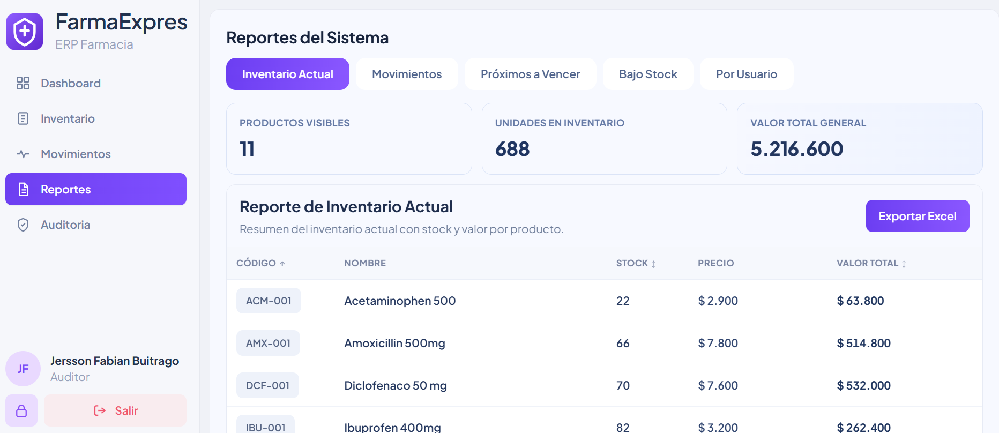

### CP-HU-FE-08-03 - Inventario Actual (vista + totales)

- **Objetivo:** Validar indicadores, tabla y total general.
- **Acción ejecutada:** Abrir pestaña Inventario Actual.
- **Resultado evidenciado:** Tabla y total general coherentes con datos backend.
- **Evidencia:**

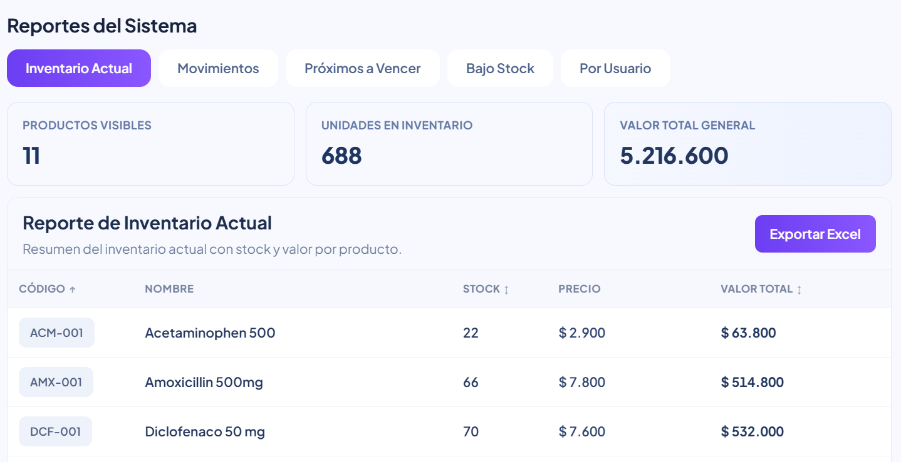

### CP-HU-FE-08-04 - Exportación Excel Inventario Actual

- **Objetivo:** Validar exportación profesional de Inventario Actual.
- **Acción ejecutada:** Clic en Exportar Excel.
- **Resultado evidenciado:** Archivo con columnas y total general.
- **Evidencia:**

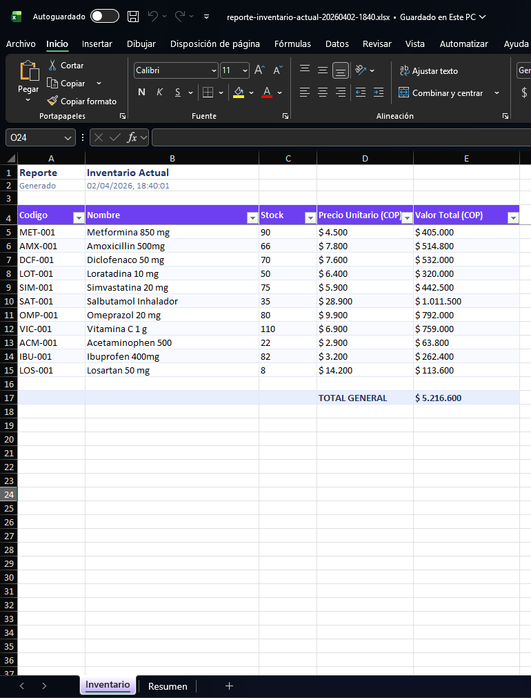

### CP-HU-FE-08-05 - Movimientos (filtros + detalle ajuste)

- **Objetivo:** Validar tabla de movimientos con motivo y detalle ajuste.
- **Acción ejecutada:** Abrir Movimientos y aplicar filtros.
- **Resultado evidenciado:** Resultados filtrados y columnas completas.
- **Evidencia:**

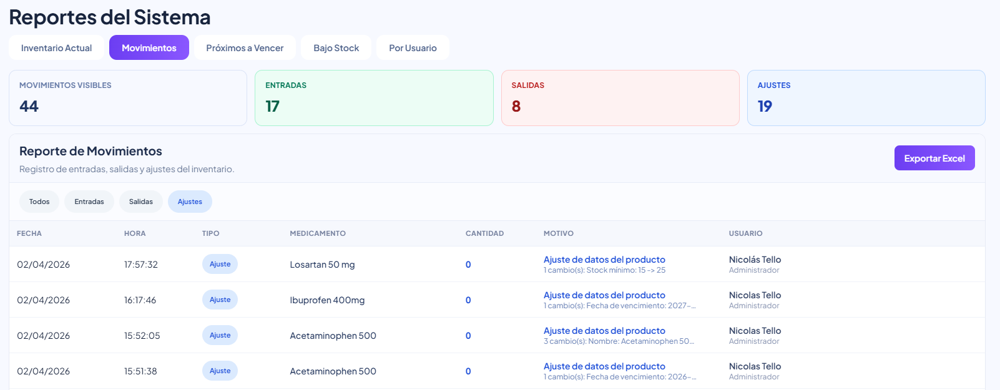

### CP-HU-FE-08-06 - Exportación Excel Movimientos

- **Objetivo:** Validar exportación de movimientos.
- **Acción ejecutada:** Exportar desde pestaña Movimientos.
- **Resultado evidenciado:** Excel con motivo y detalle ajuste visibles.
- **Evidencia:**

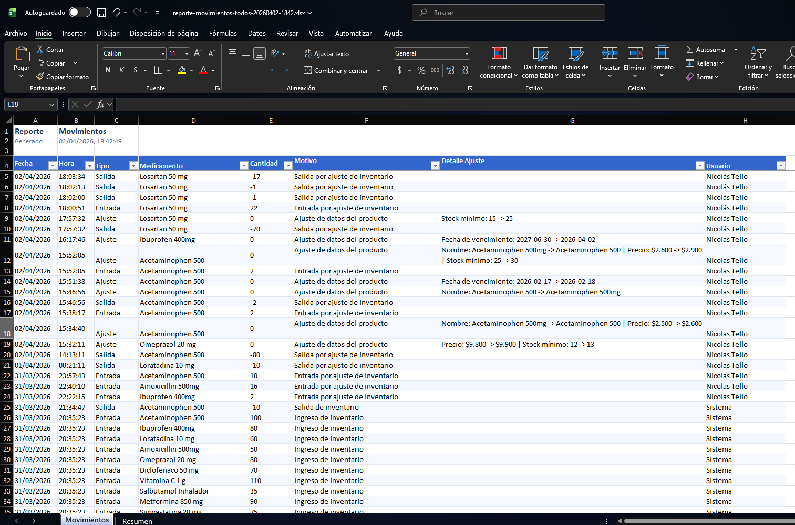

### CP-HU-FE-08-07 - Próximos a Vencer (prioridades)

- **Objetivo:** Validar clasificación visual por vencimiento.
- **Acción ejecutada:** Abrir pestaña Próximos a Vencer.
- **Resultado evidenciado:** Estados/prioridades correctos (vencido, vence hoy, rangos).
- **Evidencia:**

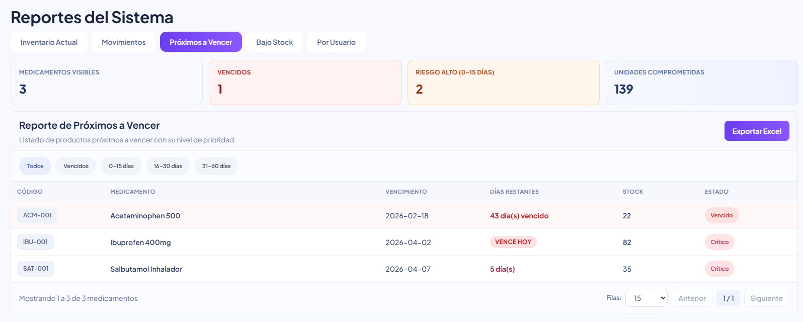

### CP-HU-FE-08-08 - Exportación Excel Próximos a Vencer

- **Objetivo:** Validar exportación de próximos a vencer.
- **Acción ejecutada:** Exportar desde pestaña.
- **Resultado evidenciado:** Archivo con datos y columnas esperadas.
- **Evidencia:**

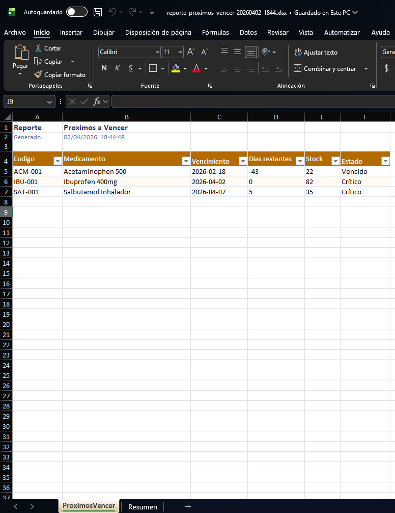

### CP-HU-FE-08-09 - Bajo Stock (indicadores + tabla)

- **Objetivo:** Validar reporte de bajo stock.
- **Acción ejecutada:** Abrir pestaña Bajo Stock.
- **Resultado evidenciado:** Indicadores críticos/alerta y tabla coherente.
- **Evidencia:**

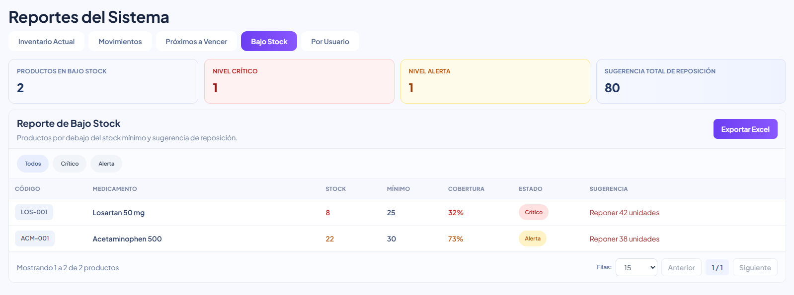

### CP-HU-FE-08-10 - Exportación Excel Bajo Stock

- **Objetivo:** Validar exportación de bajo stock.
- **Acción ejecutada:** Exportar desde pestaña.
- **Resultado evidenciado:** Excel con estado/sugerencia y formato correcto.
- **Evidencia:**

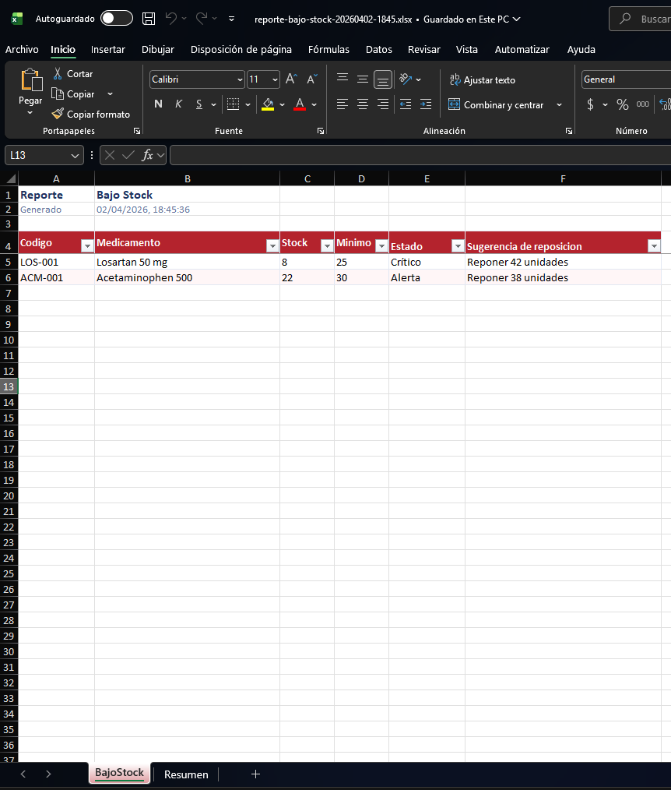

### CP-HU-FE-08-11 - Por Usuario (actividad operativa)

- **Objetivo:** Validar métricas y tabla por usuario.
- **Acción ejecutada:** Abrir pestaña Por Usuario.
- **Resultado evidenciado:** Roles/actividad y métricas visibles correctamente.
- **Evidencia:**

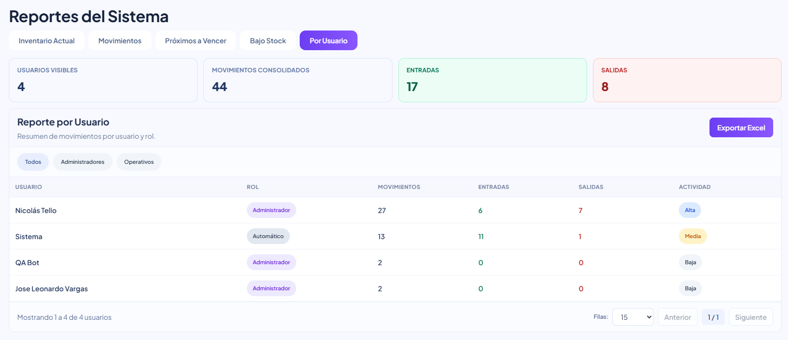

### CP-HU-FE-08-12 - Exportación Excel Por Usuario

- **Objetivo:** Validar exportación del reporte por usuario.
- **Acción ejecutada:** Exportar desde pestaña.
- **Resultado evidenciado:** Excel con actividad y columnas acordadas.
- **Evidencia:**

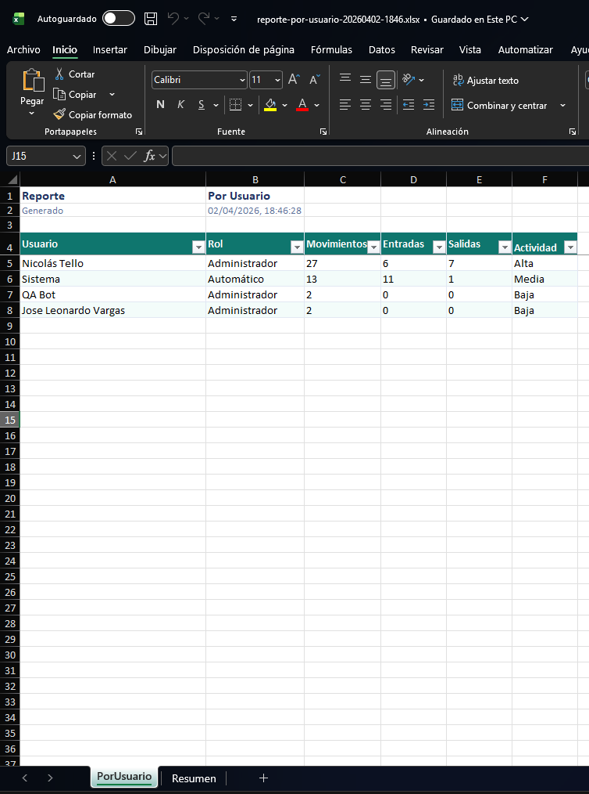

---

## 3. Conclusiones de Prueba

- La HU-FE-08 queda validada en integración frontend+backend para navegación, consulta y exportación por sección.
- Se confirma persistencia de contexto de uso (pestaña/filtros) y comportamiento de seguridad por expiración de sesión.
- Se valida control de acceso por rol para el módulo de reportes.
