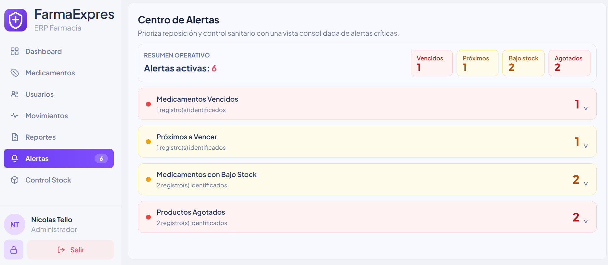
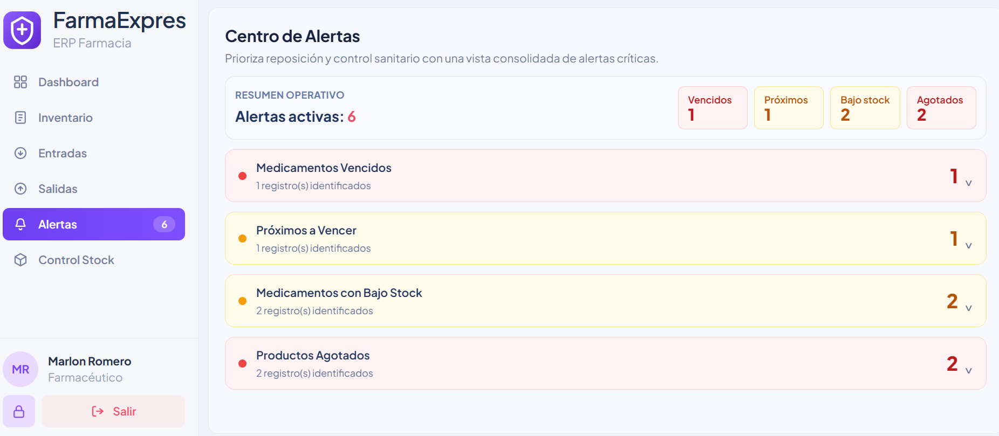
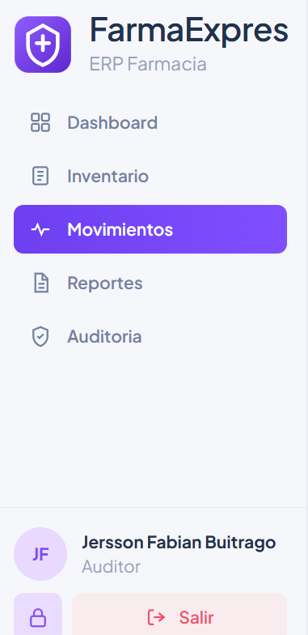
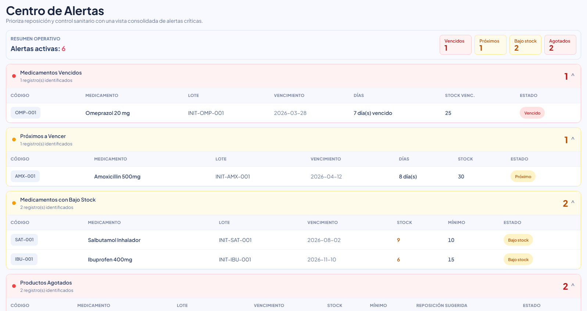
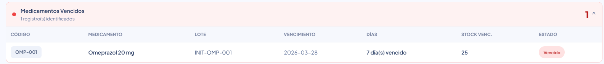
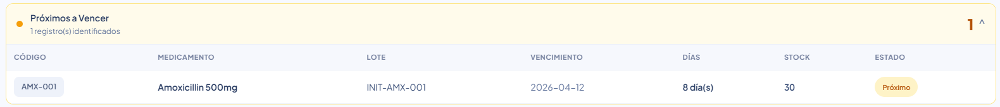
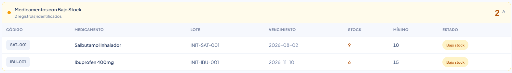
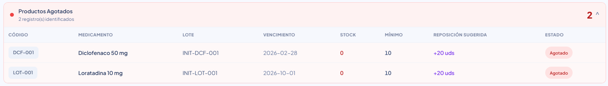

# HU-QA-FE-09 - Centro de Alertas

## 1. Historia de Usuario

### 1.1 Identificación

- **Título:** Inventario - Centro de Alertas (Vencidos, Próximos, Bajo Stock, Agotados)
- **ID:** HU-FE-09
- **Relacionado:** HU-RF-09 (Backend)
- **Prioridad:** Must Have (Alta)

### 1.2 Descripción

Como **usuario autorizado (Administrador o Farmacéutico)**,  
quiero **visualizar y gestionar las alertas críticas del inventario desde un centro unificado**,  
para **identificar productos vencidos, próximos a vencer, en bajo stock y agotados, y tomar decisiones oportunas de reposición/control sanitario**.

### 1.3 Criterios de Aceptación

#### Interfaz

- [x] Existe la vista **Centro de Alertas**.
- [x] Existen secciones: **Medicamentos Vencidos**, **Próximos a Vencer**, **Medicamentos con Bajo Stock**, **Productos Agotados**.
- [x] Las secciones cargan **colapsadas por defecto** y se expanden al hacer clic.
- [x] Existe resumen operativo con conteo total y conteo por sección.

#### Información mostrada

- [x] Cada sección muestra tabla/listado con datos de lote/producto según corresponda.
- [x] Se muestra código y nombre del medicamento.
- [x] En vencidos/próximos se muestra lote y fecha de vencimiento.
- [x] En bajo stock se muestra stock, mínimo y estado.
- [x] En agotados se muestra stock = 0 y reposición sugerida.

#### Indicadores visuales

- [x] Los estados críticos se muestran en color de alerta (rojo/ámbar según tipo).
- [x] Se mantiene diferenciación visual clara por tipo de alerta.
- [x] Vencidos se distinguen visualmente de próximos a vencer.

#### Integración con Backend

- [x] El frontend consume endpoints batch-aware del centro de alertas.
- [x] Se incluye token en headers (`Authorization: Bearer`).
- [x] El badge de alertas en sidebar refleja el total consolidado.

#### Respuesta del Sistema

**Éxito:**

- [x] Se muestran alertas correctamente por sección.

**Sin datos:**

- [x] Se muestra mensaje vacío por sección cuando no hay registros.

**Error:**

- [x] Se muestra mensaje si falla la carga total o parcial.

#### Control de Acceso

- [x] Rol **Administrador** puede acceder al Centro de Alertas.
- [x] Rol **Farmacéutico** puede acceder al Centro de Alertas.
- [x] Rol **Auditor** no accede desde sidebar a esta vista.

### 1.4 Checklist QA

- [x] Se renderiza Centro de Alertas con 4 secciones.
- [x] Conteos por sección y total general consistentes.
- [x] No mezcla productos agotados dentro de bajo stock.
- [x] Manejo correcto de secciones vacías.
- [x] Manejo correcto de errores de integración.
- [x] Respeta control de acceso por rol.
- [x] Se mantiene UX colapsada inicial para evitar sobrecarga visual.

### 1.5 Notas Técnicas

- Se consolidó la funcionalidad en un **Centro de Alertas** único.
- Se priorizó consumo backend batch-aware para evitar inconsistencias.
- El resumen superior y el badge de sidebar se calculan con la suma de secciones.
- Se mantiene enfoque operativo para priorización de decisiones.

### 1.6 Flujo de Usuario

1. El usuario autorizado abre **Alertas** desde sidebar.  
2. Visualiza resumen operativo y conteos por categoría.  
3. Expande la sección de interés (vencidos, próximos, bajo stock o agotados).  
4. Revisa registros y prioriza acciones operativas.  

---

## 2. Casos de Prueba Ejecutados (HU-FE-09)

> Ruta de evidencias: `doc/images/HU-FE-09/`

### CP-HU-FE-09-01 - Acceso al Centro de Alertas (Administrador)

- **Objetivo:** Validar acceso del rol Administrador.
- **Acción ejecutada:** Iniciar sesión como admin y abrir Alertas.
- **Resultado evidenciado:** Visualiza centro de alertas.
- **Evidencia:**

### CP-HU-FE-09-02 - Acceso al Centro de Alertas (Farmacéutico)

- **Objetivo:** Validar acceso del rol Farmacéutico.
- **Acción ejecutada:** Iniciar sesión como farmacéutico y abrir Alertas.
- **Resultado evidenciado:** Visualiza centro de alertas.
- **Evidencia:**

### CP-HU-FE-09-03 - Restricción de acceso desde sidebar (Auditor)

- **Objetivo:** Validar restricción para Auditor en navegación lateral.
- **Acción ejecutada:** Iniciar sesión como auditor y revisar sidebar.
- **Resultado evidenciado:** No aparece acceso directo a Alertas.
- **Evidencia:**

### CP-HU-FE-09-04 - Vista inicial colapsada

- **Objetivo:** Validar que secciones cargan colapsadas.
- **Acción ejecutada:** Abrir Alertas.
- **Resultado evidenciado:** Secciones cerradas inicialmente.
- **Evidencia:**

### CP-HU-FE-09-05 - Expandir sección Medicamentos Vencidos

- **Objetivo:** Validar despliegue de vencidos.
- **Acción ejecutada:** Expandir “Medicamentos Vencidos”.
- **Resultado evidenciado:** Muestra registros de vencidos.
- **Evidencia:**

### CP-HU-FE-09-06 - Expandir sección Próximos a Vencer

- **Objetivo:** Validar despliegue de próximos.
- **Acción ejecutada:** Expandir “Próximos a Vencer”.
- **Resultado evidenciado:** Muestra registros próximos.
- **Evidencia:**

### CP-HU-FE-09-07 - Expandir sección Bajo Stock

- **Objetivo:** Validar despliegue de bajo stock.
- **Acción ejecutada:** Expandir “Medicamentos con Bajo Stock”.
- **Resultado evidenciado:** Muestra registros bajo stock.
- **Evidencia:**

### CP-HU-FE-09-08 - Expandir sección Agotados

- **Objetivo:** Validar despliegue de agotados.
- **Acción ejecutada:** Expandir “Productos Agotados”.
- **Resultado evidenciado:** Muestra solo stock = 0.
- **Evidencia:**

### CP-HU-FE-09-09 - Conteo de badge en sidebar

- **Objetivo:** Validar conteo consolidado de alertas.
- **Acción ejecutada:** Revisar badge “Alertas” en menú lateral.
- **Resultado evidenciado:** Coincide con suma de secciones.
- **Evidencia:**

---

## 3. Conclusiones de Prueba

- La HU-FE-09 queda implementada y validada en el **Centro de Alertas** como módulo unificado.
- Se confirma separación operativa entre categorías críticas del inventario.
- Se valida control de acceso y comportamiento visual colapsado para mejor usabilidad.
