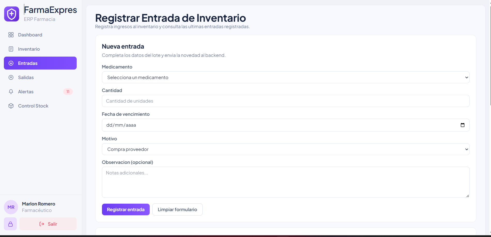
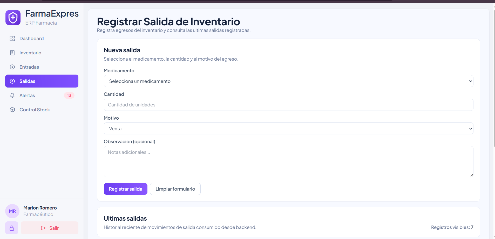
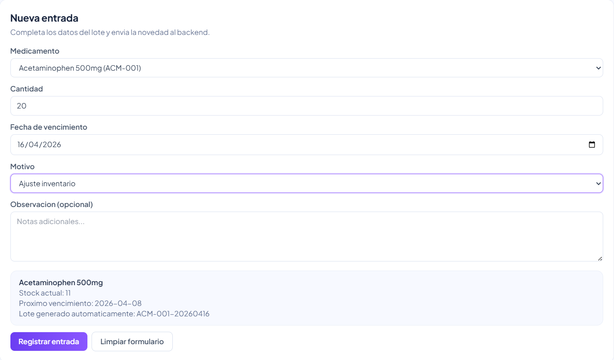
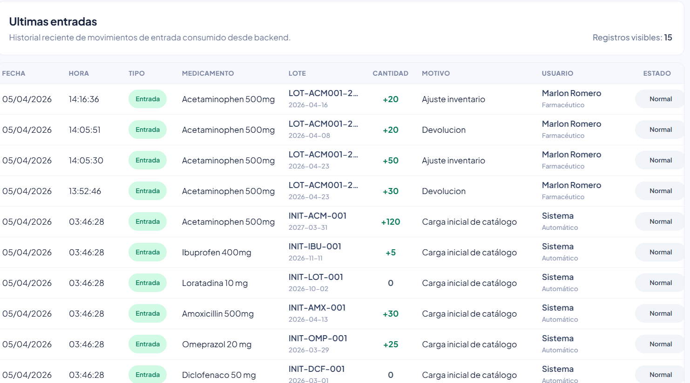
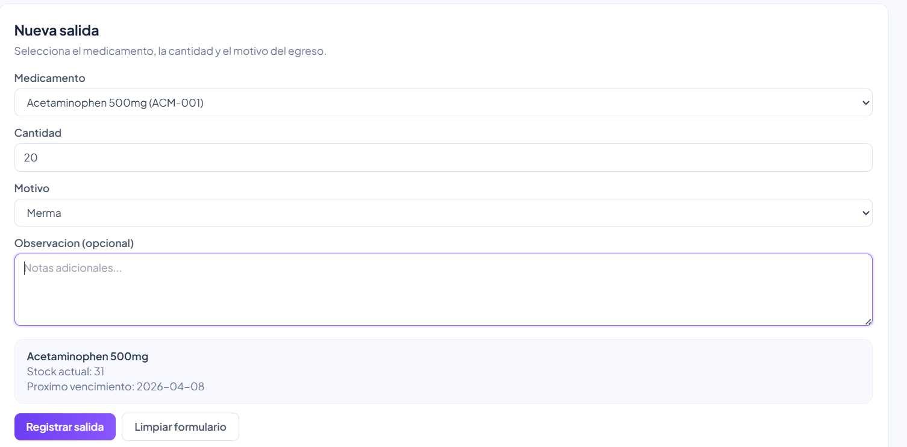
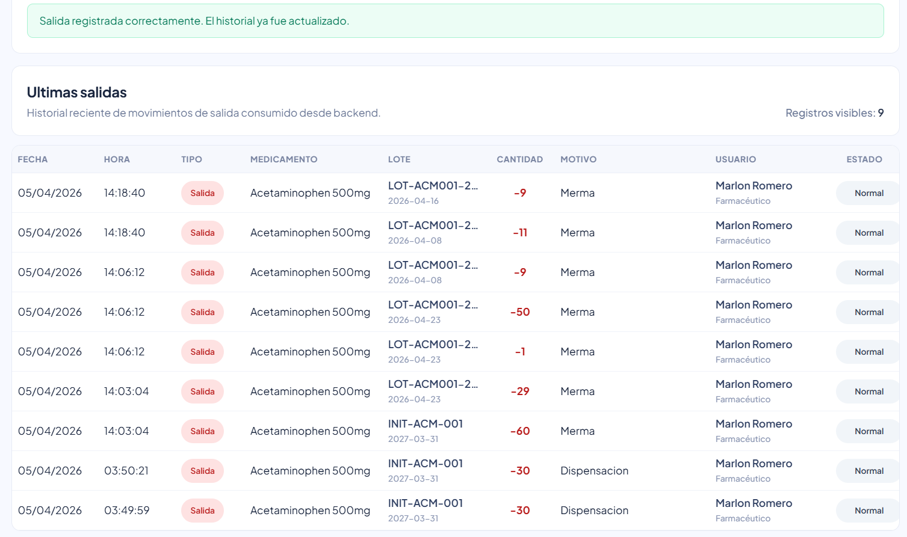
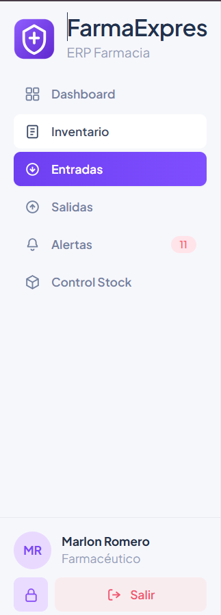
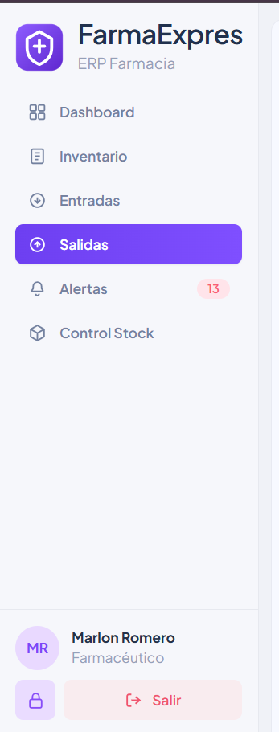
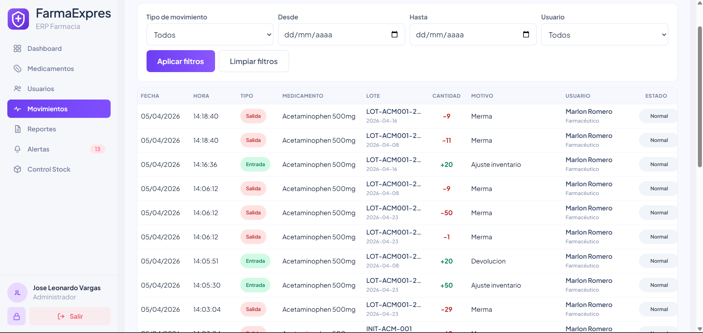

# HU-QA-FE-11 - Entradas y Salidas para Farmaceutico

## 1. Historia de Usuario

### 1.1 Identificacion

- **Titulo:** Inventario - Registro de Entradas y Salidas para rol Farmaceutico
- **ID:** HU-FE-11
- **Relacionado:** HU-015 (Backend), HU-016 (Backend)
- **Prioridad:** Must Have (Alta)

### 1.2 Descripcion

Como **usuario con rol Farmaceutico**,
quiero **ingresar a las opciones Entradas y Salidas desde la interfaz, registrar movimientos y consultar su historial**,
para **gestionar el inventario operativo consumiendo los endpoints ya implementados por backend**.

### 1.3 Justificacion

Actualmente el rol **Farmaceutico** visualiza en el sidebar las opciones **Entradas** y **Salidas**, pero no puede acceder a estas vistas ni utilizar la funcionalidad esperada.

Esto genera una inconsistencia funcional y de experiencia de usuario, porque:

- el sistema muestra opciones de navegacion que no estan habilitadas realmente para el rol;
- el farmaceutico necesita registrar ingresos y egresos de inventario en su operacion diaria;
- el backend ya implemento los metodos necesarios mediante las HU **HU-015** y **HU-016**;
- el frontend aun no consume dichos endpoints;
- ademas del registro, el usuario requiere consultar el historial reciente de entradas y salidas para trazabilidad.

Por lo anterior, se requiere habilitar en frontend el acceso del rol **Farmaceutico** a los modulos **Entradas** y **Salidas**, integrando la interfaz con los servicios del backend para registrar movimientos y visualizar su historial.

### 1.4 Criterios de Aceptacion

#### Navegacion y acceso

- [x] El rol **Farmaceutico** puede ingresar a la opcion **Entradas** desde el menu lateral.
- [x] El rol **Farmaceutico** puede ingresar a la opcion **Salidas** desde el menu lateral.
- [x] Si el usuario Farmaceutico navega directamente por URL a las rutas de entradas o salidas, el sistema permite el acceso.
- [x] El control de acceso se respeta tanto en sidebar como en rutas protegidas.

#### Registro de entradas

- [x] Existe la vista **Registrar Entrada de Inventario**.
- [x] El formulario de entrada consume `POST /api/movements/entries` por medio del gateway.
- [x] El formulario envia los campos requeridos por backend para registrar una entrada.
- [x] Si el registro es exitoso, el sistema muestra mensaje de confirmacion.
- [x] Si backend rechaza la solicitud, el frontend muestra el error correspondiente.

#### Registro de salidas

- [x] Existe la vista **Registrar Salida de Inventario**.
- [x] El formulario de salida consume `POST /api/movements/exits` por medio del gateway.
- [x] El formulario envia los campos requeridos por backend para registrar una salida.
- [x] Si el registro es exitoso, el sistema muestra mensaje de confirmacion.
- [x] Si backend rechaza la solicitud, el frontend muestra el error correspondiente.

#### Historial de movimientos

- [x] La vista **Entradas** muestra un historial reciente de entradas registradas.
- [x] La vista **Salidas** muestra un historial reciente de salidas registradas.
- [x] El historial presenta como minimo fecha, medicamento, cantidad, motivo y usuario.
- [x] Despues de registrar una entrada o salida, el historial correspondiente se actualiza sin recarga manual.
- [x] El historial de **Entradas** se obtiene consumiendo un endpoint `GET` del backend.
- [x] El historial de **Salidas** se obtiene consumiendo un endpoint `GET` del backend.

#### Integracion con Backend

- [x] El frontend consume los endpoints oficiales implementados en backend para entradas y salidas.
- [x] El frontend consume `POST` para registrar entradas y salidas.
- [x] El frontend consume `GET` para consultar el historial de entradas y salidas.
- [x] El frontend consulta el historial de entradas y salidas usando los endpoints habilitados para `FARMACEUTICO`.
- [x] Se incluye token en headers (`Authorization: Bearer`) en las peticiones protegidas.

### 1.5 Checklist QA

- [x] El rol Farmaceutico puede abrir la vista **Entradas**.
- [x] El rol Farmaceutico puede abrir la vista **Salidas**.
- [x] Se registra correctamente una entrada consumiendo backend.
- [x] Se registra correctamente una salida consumiendo backend.
- [x] Se visualiza el historial de entradas.
- [x] Se visualiza el historial de salidas.
- [x] Se muestran mensajes de error si falla una solicitud.
- [x] Se respeta el control de acceso por rol.

### 1.5.1 Estado implementado en frontend

- Se habilitaron las rutas operativas `/entries` y `/exits` con alias de acceso directo `/entradas` y `/salidas`.
- El sidebar del rol **Farmaceutico** ahora navega de forma real a **Entradas** y **Salidas**.
- La vista de **Entradas** registra con `POST /api/movements/entries` y refresca su historial con `GET /api/movements/entrance`.
- La vista de **Salidas** registra con `POST /api/movements/exits` y refresca su historial con `GET /api/movements/exit`.
- En **Entradas**, el motivo se controla por selector y el lote se genera automaticamente a partir del medicamento y la fecha de vencimiento.
- En **Entradas** y **Salidas**, la observacion es opcional y los mensajes de error/exito se muestran dentro de la misma vista.

### 1.6 Como se implementara

- Se habilitara la navegacion real de los items **Entradas** y **Salidas** en el sidebar para el rol **Farmaceutico**.
- Se ajustaran las rutas protegidas del frontend para permitir el acceso del Farmaceutico a estas vistas.
- Se crearan o adaptaran las vistas operativas de **Entradas** y **Salidas** con sus formularios y tablas de historial.
- Se integrara el consumo de `POST /api/movements/entries` para registrar entradas.
- Se integrara el consumo de `POST /api/movements/exits` para registrar salidas.
- Se integrara la consulta `GET` del historial de entradas y salidas usando los endpoints habilitados por backend.
- Se agregaran estados de interfaz para carga, exito, error y vacio.
- Se refrescara el historial despues de cada operacion exitosa.

### 1.7 Que se modificara

- `frontend/src/layout/components/Sidebar.jsx`
  - Habilitar navegacion a **Entradas** y **Salidas** para el rol Farmaceutico.

- `frontend/src/App.jsx`
  - Registrar y proteger las rutas de entradas y salidas segun RBAC.

- `frontend/src/shared/constants/roles.js`
  - Ajustar permisos por rol si la autorizacion esta centralizada en constantes.

- `frontend/src/movements/services/movements.service.js`
  - Incorporar metodos para registrar entradas, registrar salidas y consultar historiales.

- `frontend/src/movements/pages/`
  - Crear o adaptar las paginas de **Entradas** y **Salidas**.

- `frontend/src/movements/pages/EntriesPage.jsx`
  - Implementar vista operativa para registrar entradas y consultar historial reciente.

- `frontend/src/movements/pages/ExitsPage.jsx`
  - Implementar vista operativa para registrar salidas y consultar historial reciente.

- `frontend/src/movements/components/`
  - Implementar o adaptar formularios de captura y tablas de historial.

### 1.8 Notas Tecnicas

- Esta HU es de **frontend** y depende de las HU de backend **HU-015** y **HU-016**.
- El consumo debe hacerse por el gateway con rutas `/api/...`.
- La HU no solo requiere `POST`; tambien requiere consumo `GET` para renderizar el historial visible de **Ultimas Entradas** y **Ultimas Salidas**.
- El frontend debe respetar el contrato real expuesto por backend para campos obligatorios.
- Si backend requiere datos adicionales para entradas, como `expirationDate`, la vista debe contemplarlos.
- La logica de negocio por lote se mantiene en backend; el frontend solo captura, envia y presenta resultados.
- Para mejorar la navegacion del rol Farmaceutico, tambien se dejaron aliases `/entradas` y `/salidas` que redirigen a las rutas internas del modulo.
- En el flujo de entradas, el frontend envia `amount` y `quantity` para mantener compatibilidad con la validacion actual del backend.

### 1.9 Flujo de Usuario

1. El usuario inicia sesion con rol **Farmaceutico**.
2. Visualiza las opciones **Entradas** y **Salidas** en el sidebar.
3. Accede a una de las vistas.
4. Diligencia el formulario correspondiente.
5. El frontend envia la solicitud al endpoint del backend.
6. El sistema muestra confirmacion o error.
7. El historial de la vista se actualiza con la informacion mas reciente.

---

## 2. Casos de Prueba Propuestos (HU-FE-11)

> Ruta sugerida de evidencias: `doc/images/HU-FE-11/`

### CP-HU-FE-11-01 - Acceso a Entradas desde sidebar

- **Objetivo:** Validar acceso del rol Farmaceutico a la vista de Entradas.
- **Accion ejecutada:** Iniciar sesion como Farmaceutico y hacer clic en **Entradas**.
- **Resultado esperado:** Se abre la vista de registro de entradas con su historial.

### CP-HU-FE-11-02 - Acceso a Salidas desde sidebar

- **Objetivo:** Validar acceso del rol Farmaceutico a la vista de Salidas.
- **Accion ejecutada:** Iniciar sesion como Farmaceutico y hacer clic en **Salidas**.
- **Resultado esperado:** Se abre la vista de registro de salidas con su historial.

### CP-HU-FE-11-03 - Registro exitoso de entrada

- **Objetivo:** Validar que el frontend consume correctamente el endpoint de entrada.
- **Accion ejecutada:** Completar el formulario de entrada con datos validos y enviar.
- **Resultado esperado:** Se consume `POST /api/movements/entries`, se muestra exito y se actualiza el historial.

### CP-HU-FE-11-04 - Registro exitoso de salida

- **Objetivo:** Validar que el frontend consume correctamente el endpoint de salida.
- **Accion ejecutada:** Completar el formulario de salida con datos validos y enviar.
- **Resultado esperado:** Se consume `POST /api/movements/exits`, se muestra exito y se actualiza el historial.

### CP-HU-FE-11-05 - Visualizacion de historial de entradas

- **Objetivo:** Validar que la vista de Entradas muestra historial reciente.
- **Accion ejecutada:** Abrir la vista de Entradas y revisar la tabla inferior.
- **Resultado esperado:** Se consume un `GET` de backend y se visualizan registros con fecha, medicamento, cantidad, motivo y usuario.

### CP-HU-FE-11-06 - Visualizacion de historial de salidas

- **Objetivo:** Validar que la vista de Salidas muestra historial reciente.
- **Accion ejecutada:** Abrir la vista de Salidas y revisar la tabla inferior.
- **Resultado esperado:** Se consume un `GET` de backend y se visualizan registros con fecha, medicamento, cantidad, motivo y usuario.

### CP-HU-FE-11-07 - Manejo de errores de backend

- **Objetivo:** Validar mensajes de error funcionales sin romper la pantalla.
- **Accion ejecutada:** Enviar una solicitud rechazada por backend.
- **Resultado esperado:** El sistema muestra un mensaje de error y mantiene el formulario operativo.

### CP-HU-FE-11-08 - Restriccion de acceso por rol

- **Objetivo:** Validar que un rol no autorizado no puede acceder a las vistas.
- **Accion ejecutada:** Intentar ingresar a rutas de entradas o salidas con un rol no permitido.
- **Resultado esperado:** El sistema bloquea o redirige el acceso segun la politica vigente.

---

## 3. Conclusiones Esperadas

- La HU-FE-11 habilita una capacidad operativa que ya estaba visible en la interfaz pero no funcional para el rol **Farmaceutico**.
- El frontend aprovecha los endpoints desarrollados en backend para entradas y salidas sin duplicar logica de negocio.
- El rol **Farmaceutico** podra registrar movimientos y consultar su historial desde una experiencia coherente con el resto del sistema.
