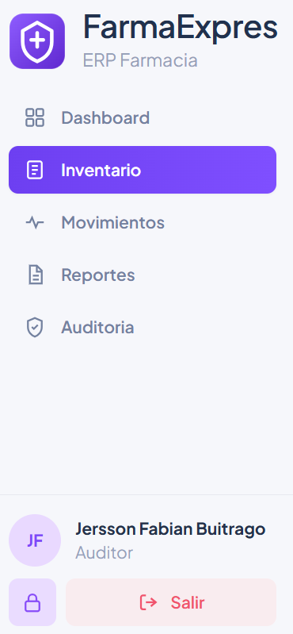
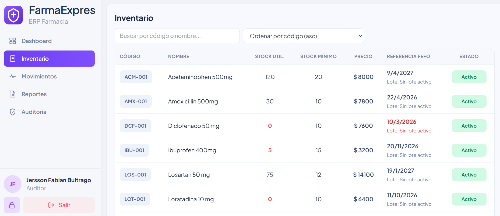
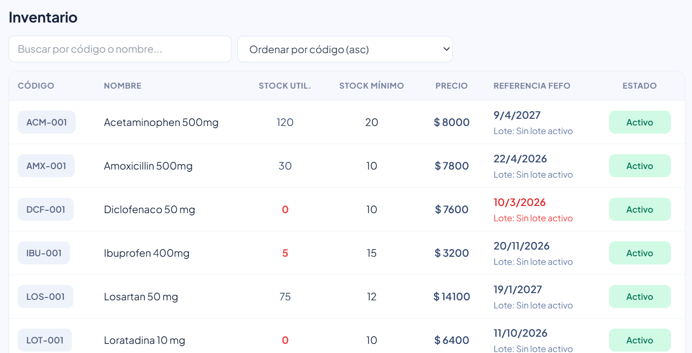
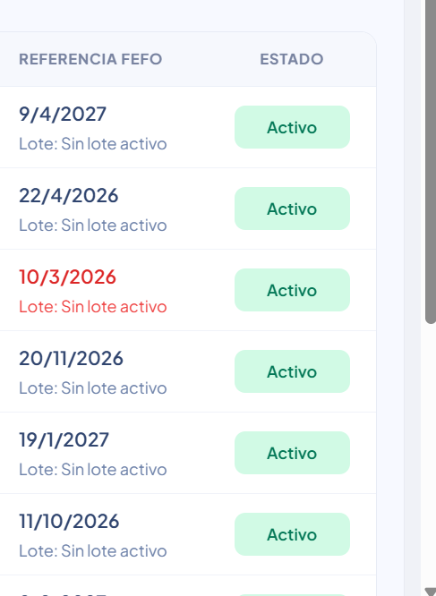
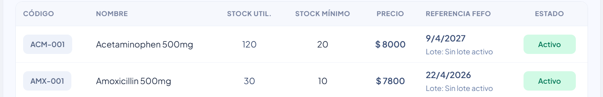

# HU-QA-FE-12 - Inventario solo lectura para Auditor

## 1. Historia de Usuario

### 1.1 Identificacion

- **Titulo:** Habilitar acceso de solo lectura al modulo Inventario para rol Auditor
- **ID:** HU-FE-12
- **Relacionado:** HU-FE-10 (Inventario solo lectura para Farmaceutico)
- **Prioridad:** Must Have (Alta)

### 1.2 Descripcion

Como **usuario con rol Auditor**,
quiero **visualizar e ingresar al modulo Inventario desde el menu lateral en modo solo lectura**,
para **consultar existencias, lotes, fechas y estado de los productos sin modificar datos del sistema**.

### 1.3 Justificacion

Actualmente el rol **Auditor** requiere consultar inventario para verificacion y trazabilidad, pero sin ejecutar acciones operativas.
Esto es necesario para mantener control por roles, porque:

- el auditor necesita consultar informacion real del inventario;
- la operacion de inventario debe mantenerse restringida a roles autorizados;
- el sistema debe garantizar consistencia de permisos en sidebar, rutas y acciones;
- se evita alteracion de stock por un rol de consulta.

Por lo anterior, se habilita acceso del rol **Auditor** al modulo **Inventario** bajo esquema de **solo lectura**.

### 1.4 Criterios de Aceptacion

#### Navegacion y acceso

- [x] El rol **Auditor** visualiza la opcion **Inventario** en el sidebar.
- [x] El rol **Auditor** puede ingresar al modulo Inventario.
- [x] Si el usuario Auditor navega por URL a inventario, el sistema permite acceso.

#### Visualizacion de informacion

- [x] El rol Auditor visualiza la tabla de inventario.
- [x] La tabla mantiene datos de consulta (codigo, nombre, lote, fechas, cantidades, estado).
- [x] La experiencia visual de consulta se mantiene consistente.

#### Restriccion de acciones

- [x] El rol Auditor no visualiza acciones de crear.
- [x] El rol Auditor no visualiza acciones de editar.
- [x] El rol Auditor no visualiza acciones de desactivar/eliminar.
- [x] El sistema bloquea o redirige ante rutas de modificacion no permitidas.

#### Control de acceso por rol

- [x] El rol Administrador mantiene capacidades de gestion.
- [x] El rol Auditor conserva unicamente permisos de consulta.
- [x] El RBAC se aplica en menu, rutas y componentes.

### 1.5 Checklist QA

- [x] Login exitoso con usuario de rol Auditor.
- [x] Opcion Inventario visible en sidebar para Auditor.
- [x] Navegacion exitosa a modulo Inventario.
- [x] Tabla visible con datos de consulta.
- [x] No hay botones de crear/editar/desactivar para Auditor.
- [x] Intento de ruta de edicion/creacion se bloquea o redirige.

### 1.5.1 Estado implementado en frontend

- Se habilito acceso de Auditor al modulo Inventario desde sidebar y rutas permitidas.
- Se mantuvo el modulo en modo consulta para Auditor.
- Se ocultaron acciones de modificacion en componentes de inventario para este rol.
- Se validaron restricciones de acceso en rutas protegidas.

### 1.6 Como se implementara

- Habilitar opcion Inventario para Auditor en navegacion lateral.
- Ajustar permisos en rutas protegidas para permitir consulta y bloquear edicion.
- Reutilizar la vista de inventario existente en modo solo lectura para Auditor.
- Validar en UI y rutas que no existan caminos de escritura para este rol.

### 1.7 Que se modificara

- `frontend/src/layout/components/Sidebar.jsx`
  - Habilitar acceso al modulo Inventario para rol Auditor.

- `frontend/src/App.jsx`
  - Ajustar rutas protegidas para acceso de consulta del rol Auditor.

- `frontend/src/shared/constants/roles.js`
  - Consolidar reglas RBAC de acceso y restricciones para inventario.

- `frontend/src/medicines/pages/MedicinesPage.jsx`
  - Mantener render en modo consulta para Auditor.

- `frontend/src/medicines/components/MedicinesTable.jsx`
  - Restringir acciones visuales de escritura para Auditor.

### 1.8 Notas Tecnicas

- La HU no crea una vista nueva; reutiliza inventario existente con restricciones por rol.
- La validacion de permisos se aplica tanto en UI como en rutas.
- Se preserva consistencia con implementacion previa de modo solo lectura para otros roles.

### 1.9 Flujo de Usuario

1. El usuario inicia sesion con rol **Auditor**.
2. Visualiza la opcion **Inventario** en el sidebar.
3. Ingresa al modulo Inventario.
4. Consulta informacion de productos y existencias.
5. El usuario no dispone de controles para crear, editar o desactivar.

---

## 2. Casos de Prueba Propuestos (HU-FE-12)

> Ruta de evidencias: `doc/images/HU-FE-12/`

### CP-HU-FE-12-01 - Sidebar Auditor muestra Inventario

- **Objetivo:** Validar visibilidad de Inventario para rol Auditor.
- **Accion ejecutada:** Iniciar sesion como Auditor y revisar sidebar.
- **Resultado esperado:** Se muestra opcion Inventario.

### CP-HU-FE-12-02 - Acceso al modulo Inventario

- **Objetivo:** Validar acceso funcional al modulo.
- **Accion ejecutada:** Hacer clic en Inventario desde sidebar.
- **Resultado esperado:** Se abre vista de inventario para consulta.

### CP-HU-FE-12-03 - Tabla visible en modo consulta

- **Objetivo:** Validar visualizacion de datos de inventario.
- **Accion ejecutada:** Revisar tabla de inventario como Auditor.
- **Resultado esperado:** Se visualizan registros sin controles de edicion.

### CP-HU-FE-12-04 - Restriccion de acciones de escritura

- **Objetivo:** Validar ausencia de acciones de modificar inventario.
- **Accion ejecutada:** Revisar botones y acciones de la vista.
- **Resultado esperado:** No se muestran crear/editar/desactivar.

### CP-HU-FE-12-05 - Bloqueo de ruta de edicion

- **Objetivo:** Validar proteccion de rutas de escritura para Auditor.
- **Accion ejecutada:** Intentar acceso directo por URL a ruta de edicion/creacion.
- **Resultado esperado:** Sistema bloquea o redirige.

---

## 3. Conclusiones Esperadas

- La HU-FE-12 habilita al rol **Auditor** para consultar inventario de forma segura.
- Se mantiene integridad del modulo al restringir acciones de escritura por RBAC.
- La validacion funcional y visual evidencia cumplimiento de modo **solo lectura**.
- Estado final: **QA Aprobada**.
