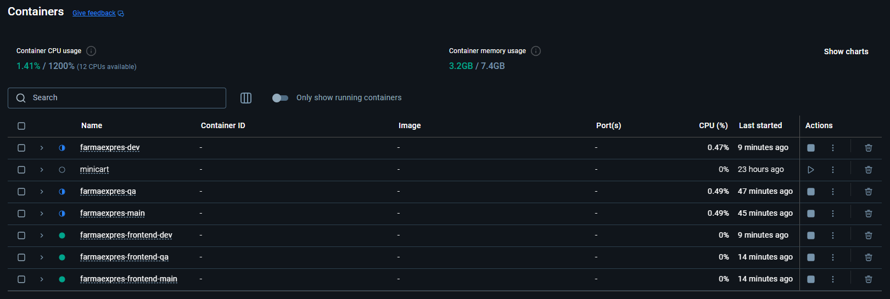
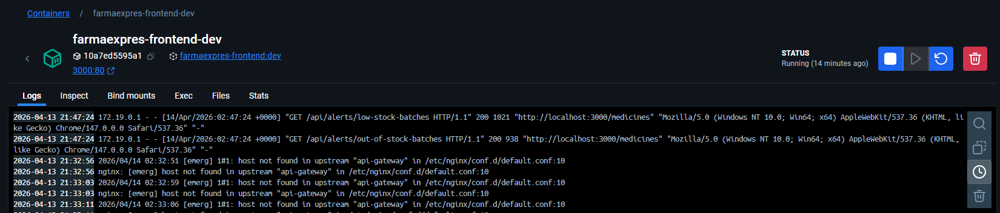
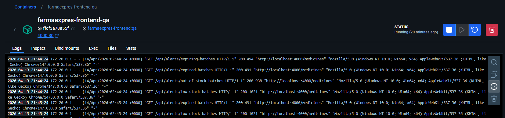
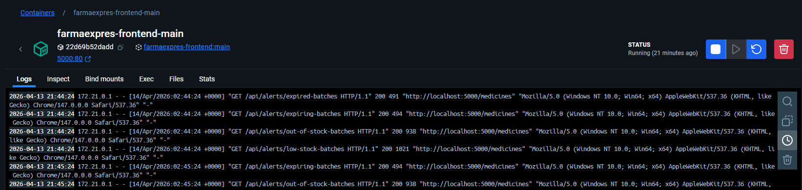
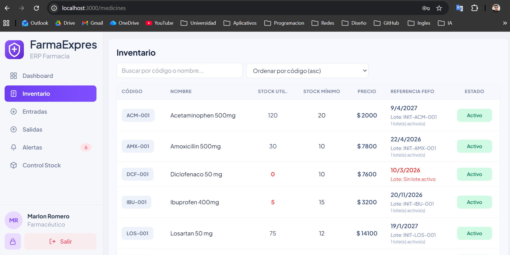
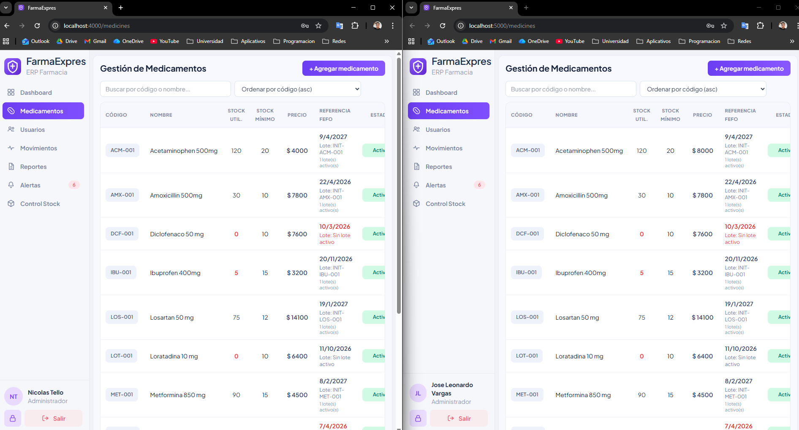

# HU-QA-FE-13 - Estrategia de puertos por ambiente para Frontend

## 1. Historia de Usuario

### 1.1 Identificacion

- **Titulo:** Parametrizar puertos y conexion por ambiente en Frontend (dev, qa, main)
- **ID:** HU-FE-13
- **Relacionado:** HU-018 (Estrategia transversal de puertos por ambiente)
- **Prioridad:** Must Have (Alta)

### 1.2 Descripcion

Como **equipo de desarrollo de FarmaExpres**,
queremos **configurar el frontend por ambiente con archivos `.env` y docker compose parametrizado**,
para **levantar dev, qa y main en paralelo, cada uno conectado al backend de su ambiente, sin conflictos de puertos**.

### 1.3 Justificacion

La separacion por ambientes evita colisiones de puertos y errores de configuracion manual.
Esto es clave porque:

- el equipo necesita validar flujos en dev, qa y main sin reconfigurar cada vez;
- cada ambiente debe tener nombre, red y puertos propios;
- el frontend debe consumir el backend correcto segun ambiente;
- se requiere trazabilidad operativa consistente con HU-018.

### 1.4 Criterios de Aceptacion

#### Configuracion por ambiente

- [x] Existen `.env.dev`, `.env.qa` y `.env.main` en `frontend/`.
- [x] Cada ambiente publica su puerto frontend:
  - dev -> `3000`
  - qa -> `4000`
  - main -> `5000`
- [x] Cada ambiente define `COMPOSE_PROJECT_NAME`.
- [x] Cada ambiente define su red backend (`BACKEND_NETWORK`).

#### Conexion frontend-backend

- [x] El frontend Docker consume backend por `BACKEND_URL`.
- [x] El frontend se conecta a la red backend del ambiente correspondiente.
- [x] Se valida conectividad interna por `api-gateway:8080` dentro de cada red de ambiente.

#### Operacion y documentacion

- [x] Se documenta ejecucion por ambiente con `docker compose --env-file`.
- [x] Se documenta troubleshooting de `502 Bad Gateway`.
- [x] Existe `.env.example` para onboarding.

### 1.5 Checklist QA

- [x] `docker compose --env-file .env.dev config` resuelve parametros de dev correctamente.
- [x] `docker compose --env-file .env.qa config` resuelve parametros de qa correctamente.
- [x] `docker compose --env-file .env.main config` resuelve parametros de main correctamente.
- [x] Los tres frontends pueden coexistir en paralelo sin conflicto de puertos.
- [x] QA y Main consumen API sin `502` tras alinear `BACKEND_URL` y red.

### 1.5.1 Estado implementado en frontend

- Se agrego `name` parametrizado en `docker-compose.yml` con `COMPOSE_PROJECT_NAME`.
- Se parametrizo `FRONTEND_PORT`, `BACKEND_URL` y `BACKEND_NETWORK` por ambiente.
- Se definieron contenedor e imagen por ambiente.
- Se agregaron scripts npm para `docker:up:*` y `docker:down:*`.
- Se documento el flujo operativo y troubleshooting en README.

### 1.6 Como se implementara

- Crear archivos `.env` por ambiente con puertos, red y backend target.
- Parametrizar `docker-compose.yml` para nombre de proyecto, puertos y red.
- Asegurar aislamiento por ambiente con redes docker externas.
- Verificar resolucion de compose y conectividad funcional del login/API.

### 1.7 Que se modificara

- `frontend/docker-compose.yml`
  - Parametrizacion por ambiente de nombre de proyecto, red, puerto y backend target.

- `frontend/.env.dev`
  - Variables de dev para frontend y backend.

- `frontend/.env.qa`
  - Variables de qa para frontend y backend.

- `frontend/.env.main`
  - Variables de main para frontend y backend.

- `frontend/.env.example`
  - Plantilla base de variables para onboarding.

- `frontend/package.json`
  - Scripts de ejecucion local y docker por ambiente.

- `frontend/vite.config.js`
  - Parametrizacion por modo para puerto y proxy en desarrollo local.

- `frontend/README.md`
  - Guia de uso por ambiente y troubleshooting.

### 1.8 Notas Tecnicas

- El puerto externo del gateway cambia por ambiente para acceso desde host.
- En comunicacion interna de contenedores, el gateway se consume por servicio y puerto interno.
- La red de backend por ambiente es obligatoria para evitar mezcla entre dev, qa y main.
- Si backend del ambiente no esta activo o red no coincide, el frontend retorna `502`.

### 1.9 Flujo de Usuario

1. El equipo selecciona ambiente (`dev`, `qa`, `main`).
2. Ejecuta frontend con `docker compose --env-file .env.<ambiente> up -d --build`.
3. El frontend publica su puerto propio y se une a su red backend.
4. El frontend enruta `/api` al `api-gateway` del mismo ambiente.
5. El ambiente funciona en paralelo sin interferir con los demas.

---

## 2. Casos de Prueba Propuestos (HU-FE-13)

> Ruta de evidencias: `doc/images/HU-FE-13/`

### CP-HU-FE-13-01 - Resolucion de compose por ambiente

- **Objetivo:** Verificar parametros de compose por ambiente.
- **Accion ejecutada:** Ejecutar `docker compose --env-file .env.<ambiente> config`.
- **Resultado esperado:** Nombre de proyecto, red y puertos correctos por ambiente.

### CP-HU-FE-13-02 - Levante paralelo de ambientes frontend

- **Objetivo:** Validar coexistencia de dev, qa y main.
- **Accion ejecutada:** Levantar los tres ambientes de frontend.
- **Resultado esperado:** Contenedores simultaneos sin conflicto de puertos.

### CP-HU-FE-13-03 - Conectividad API en dev

- **Objetivo:** Validar acceso funcional en dev.
- **Accion ejecutada:** Abrir `localhost:3000` y probar login.
- **Resultado esperado:** Flujo funcional sin error de gateway.

### CP-HU-FE-13-04 - Conectividad API en qa y main

- **Objetivo:** Validar acceso funcional en qa y main.
- **Accion ejecutada:** Abrir `localhost:4000` y `localhost:5000`, probar login/API.
- **Resultado esperado:** Flujo funcional sin `502` con red y backend alineados.

---

## 3. Conclusiones Esperadas

- La HU-FE-13 alinea el frontend con estrategia HU-018 por ambientes.
- Se logra ejecucion paralela de dev/qa/main con separacion operativa real.
- Se garantiza conexion del frontend con el backend correspondiente por ambiente.
- Estado final: **QA Aprobada**.
