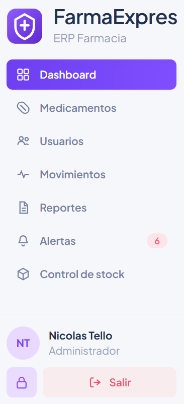
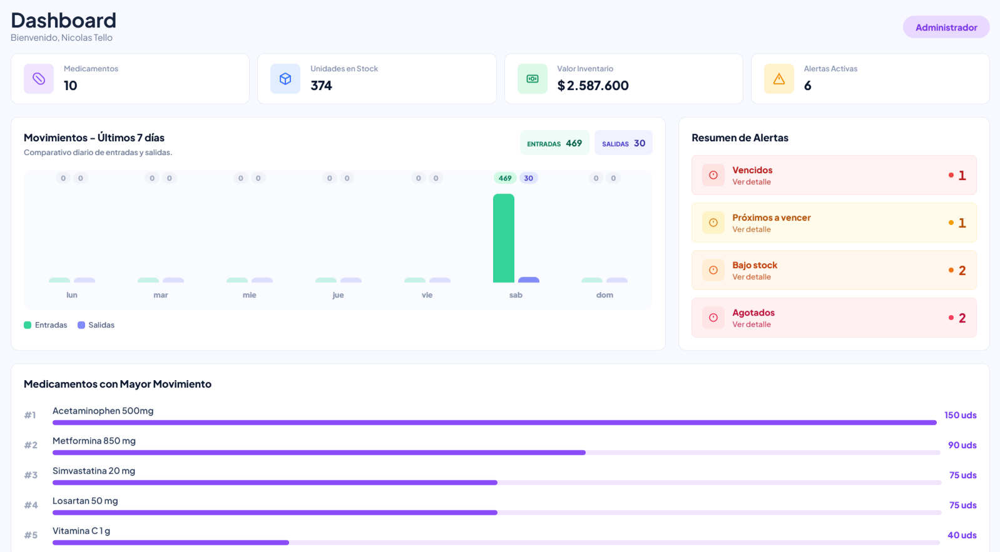
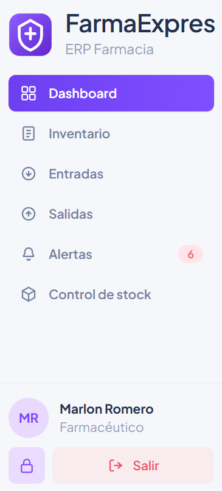
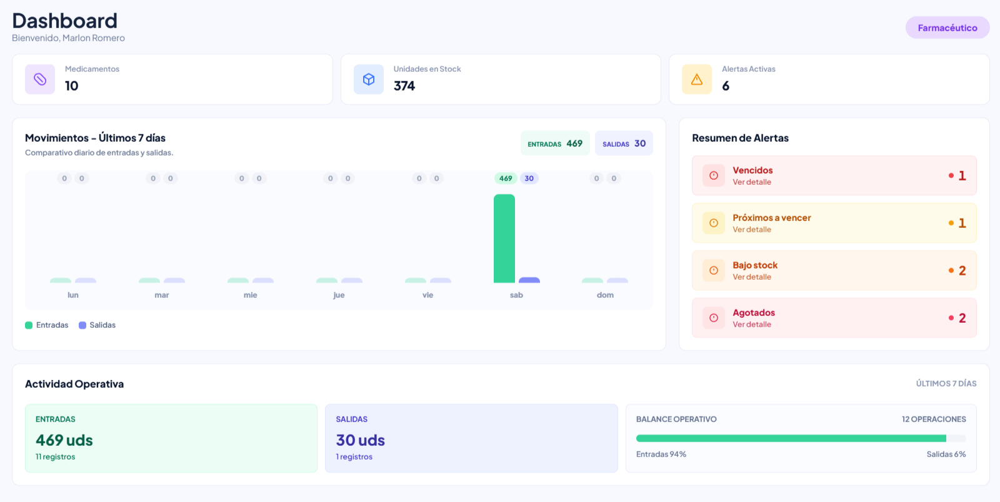
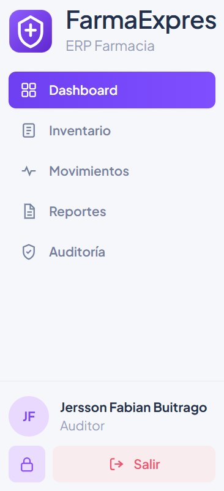
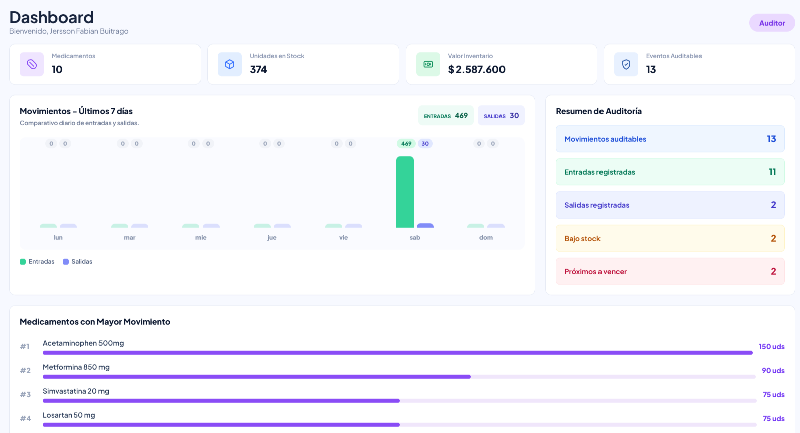

# HU-QA-NTM-14 - Dashboard por Roles

## 1. Historia de Usuario

### 1.1 Identificación

- **Título:** Dashboard inicial por rol para Administrador, Farmacéutico y Auditor
- **ID:** HU-14-NTM
- **Relacionado:** HU-FE-09, HU-FE-10, HU-FE-11, HU-FE-12
- **Prioridad:** Must Have (Alta)

### 1.2 Descripción

Como **usuario autenticado con rol Administrador, Farmacéutico o Auditor**,
quiero **ingresar al dashboard como primera vista del sistema y ver un resumen adaptado a mi rol**,
para **consultar rápidamente la información más relevante de mi operación o auditoría sin entrar primero a otros módulos**.

### 1.3 Justificación

El sistema necesitaba una vista inicial clara después del inicio de sesión. Antes, la experiencia dependía de entrar directamente a módulos específicos, lo que no ofrecía una lectura rápida del estado general para cada rol.

El dashboard debe funcionar como punto de entrada al sistema, mostrando métricas y resúmenes diferenciados según los permisos del usuario:

- el **Administrador** requiere una vista general del inventario, alertas y valor operativo;
- el **Farmacéutico** requiere una lectura operativa enfocada en medicamentos, stock, alertas y actividad reciente;
- el **Auditor** requiere información de consulta y trazabilidad, sin paneles pensados para operación directa.

Por lo anterior, esta HU se enfoca únicamente en habilitar y validar el dashboard por rol como módulo inicial y visible en el panel lateral.

### 1.4 Criterios de Aceptación

#### Acceso al dashboard

- [x] Al iniciar sesión, el usuario autenticado ingresa al **Dashboard**.
- [x] El módulo **Dashboard** aparece en el panel lateral para Administrador.
- [x] El módulo **Dashboard** aparece en el panel lateral para Farmacéutico.
- [x] El módulo **Dashboard** aparece en el panel lateral para Auditor.
- [x] Al seleccionar **Dashboard** desde el panel lateral, el sistema muestra la vista correspondiente al rol activo.

#### Dashboard Administrador

- [x] El Administrador visualiza una vista general del dashboard.
- [x] El dashboard del Administrador muestra métricas generales del inventario.
- [x] El dashboard del Administrador muestra información de alertas activas.
- [x] El dashboard del Administrador mantiene una composición visual consistente con el resto del sistema.

#### Dashboard Farmacéutico

- [x] El Farmacéutico visualiza una vista operativa del dashboard.
- [x] El dashboard del Farmacéutico muestra información útil para su operación diaria.
- [x] El dashboard del Farmacéutico no muestra información financiera restringida.
- [x] Las tarjetas del dashboard se mantienen proporcionadas y legibles.

#### Dashboard Auditor

- [x] El Auditor visualiza una vista de consulta del dashboard.
- [x] El dashboard del Auditor muestra un resumen orientado a auditoría.
- [x] El dashboard del Auditor no muestra paneles diseñados para operación farmacéutica directa.
- [x] La información visible respeta el enfoque de solo consulta del rol.

#### Experiencia visual

- [x] El dashboard mantiene diseño consistente con el sistema FarmaExpres.
- [x] Los textos visibles se presentan en español con ortografía y tildes correctas.
- [x] La vista es legible en los roles Administrador, Farmacéutico y Auditor.
- [x] Las transiciones de navegación aplican al ingresar al dashboard.

### 1.5 Checklist QA

- [x] Login con Administrador redirige al Dashboard.
- [x] Login con Farmacéutico redirige al Dashboard.
- [x] Login con Auditor redirige al Dashboard.
- [x] El panel lateral muestra la opción **Dashboard** para los tres roles.
- [x] El dashboard del Administrador muestra su resumen correspondiente.
- [x] El dashboard del Farmacéutico muestra su resumen correspondiente.
- [x] El dashboard del Auditor muestra su resumen correspondiente.
- [x] La información visible cambia según el rol autenticado.
- [x] Los textos visibles tienen tildes y ortografía correcta.
- [x] `npm run lint` pasa correctamente.
- [x] `npm run build` pasa correctamente.

### 1.5.1 Estado implementado en frontend

- Se creó el módulo de dashboard en `frontend/src/dashboard/`.
- Se configuró el dashboard como vista inicial después del inicio de sesión.
- Se agregó la opción **Dashboard** al panel lateral de los roles Administrador, Farmacéutico y Auditor.
- Se implementó renderizado diferenciado por rol.
- Se ajustaron métricas y paneles visibles para cada perfil.
- Se aplicaron transiciones de navegación al módulo.
- Se corrigieron textos visibles en español.

### 1.6 Cómo se implementó

- Se agregó una ruta protegida para `/dashboard`.
- Se ajustó la ruta inicial por rol para dirigir al dashboard.
- Se incorporó la opción **Dashboard** en el menú lateral por rol.
- Se creó una vista de dashboard capaz de adaptar contenido según el rol de sesión.
- Se reutilizaron servicios existentes para consultar la información necesaria.
- Se mantuvo el diseño visual alineado con el resto de módulos del sistema.

### 1.7 Qué se modificó

- `frontend/src/dashboard/`
  - Nuevo módulo de dashboard por roles.

- `frontend/src/App.jsx`
  - Configuración de ruta inicial y ruta protegida del dashboard.

- `frontend/src/layout/components/Sidebar.jsx`
  - Inclusión del acceso a Dashboard para los roles definidos.

- `frontend/src/shared/constants/roles.js`
  - Reglas de acceso necesarias para el módulo Dashboard.

- `frontend/src/index.css`
  - Transiciones visuales aplicadas a la navegación.

### 1.8 Notas técnicas

- La HU no crea módulos nuevos distintos al dashboard.
- La HU no documenta entradas, salidas, medicamentos inactivos, reportes ni alertas como historias independientes.
- El dashboard reutiliza información existente del sistema para construir una vista resumen.
- La información visible se adapta por rol desde el frontend, respetando permisos de navegación.

### 1.9 Flujo de usuario

1. El usuario inicia sesión.
2. El sistema identifica su rol.
3. El sistema redirige al Dashboard.
4. El usuario visualiza el resumen correspondiente a su rol.
5. El usuario puede volver al Dashboard desde el panel lateral.

---

## 2. Casos de Prueba Propuestos (HU-14-NTM)

> Ruta de evidencias: `doc/images/HU-14-NTM/`

### CP-HU-14-NTM-01 - Acceso a Dashboard desde panel lateral Administrador

- **Objetivo:** Validar que el rol Administrador visualiza el módulo Dashboard en el panel lateral.
- **Acción ejecutada:** Iniciar sesión como Administrador y revisar el panel lateral.
- **Resultado esperado:** La opción **Dashboard** aparece disponible y activa al ingresar.
- **Evidencia:**

### CP-HU-14-NTM-02 - Vista general Dashboard Administrador

- **Objetivo:** Validar la vista general del dashboard para Administrador.
- **Acción ejecutada:** Ingresar al Dashboard como Administrador.
- **Resultado esperado:** Se visualiza el resumen general correspondiente al rol Administrador.
- **Evidencia:**

### CP-HU-14-NTM-03 - Acceso a Dashboard desde panel lateral Farmacéutico

- **Objetivo:** Validar que el rol Farmacéutico visualiza el módulo Dashboard en el panel lateral.
- **Acción ejecutada:** Iniciar sesión como Farmacéutico y revisar el panel lateral.
- **Resultado esperado:** La opción **Dashboard** aparece disponible y activa al ingresar.
- **Evidencia:**

### CP-HU-14-NTM-04 - Vista general Dashboard Farmacéutico

- **Objetivo:** Validar la vista general del dashboard para Farmacéutico.
- **Acción ejecutada:** Ingresar al Dashboard como Farmacéutico.
- **Resultado esperado:** Se visualiza el resumen operativo correspondiente al rol Farmacéutico.
- **Evidencia:**

### CP-HU-14-NTM-05 - Acceso a Dashboard desde panel lateral Auditor

- **Objetivo:** Validar que el rol Auditor visualiza el módulo Dashboard en el panel lateral.
- **Acción ejecutada:** Iniciar sesión como Auditor y revisar el panel lateral.
- **Resultado esperado:** La opción **Dashboard** aparece disponible y activa al ingresar.
- **Evidencia:**

### CP-HU-14-NTM-06 - Vista general Dashboard Auditor

- **Objetivo:** Validar la vista general del dashboard para Auditor.
- **Acción ejecutada:** Ingresar al Dashboard como Auditor.
- **Resultado esperado:** Se visualiza el resumen de consulta correspondiente al rol Auditor.
- **Evidencia:**

---

## 3. Conclusiones esperadas

- La HU-14-NTM habilita el Dashboard como vista inicial para los roles principales.
- El panel lateral permite acceder al Dashboard en Administrador, Farmacéutico y Auditor.
- La vista general del Dashboard cambia según el rol autenticado.
- La experiencia visual se mantiene consistente con FarmaExpres.
- Estado final esperado: **QA aprobada**.
