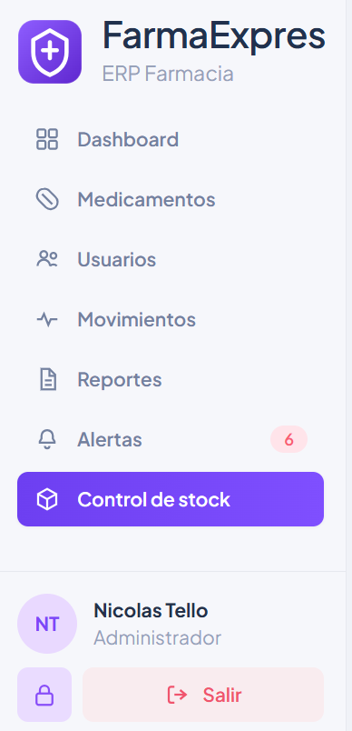
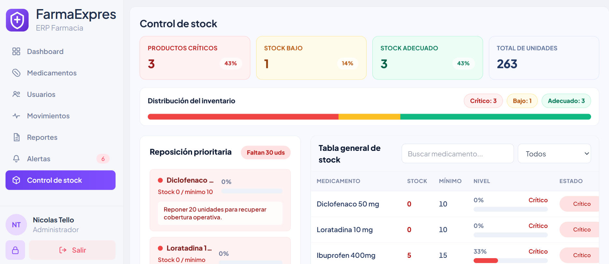
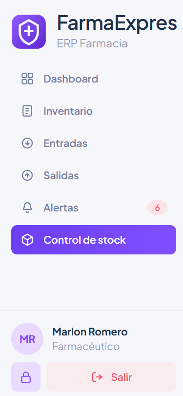
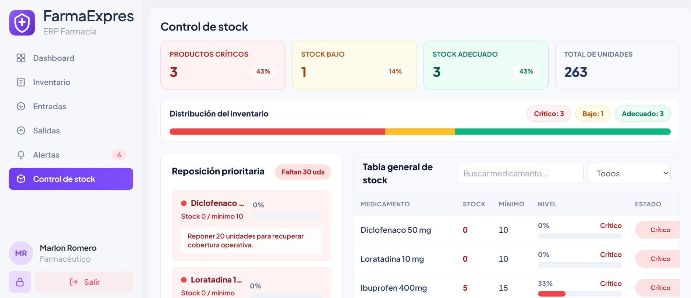
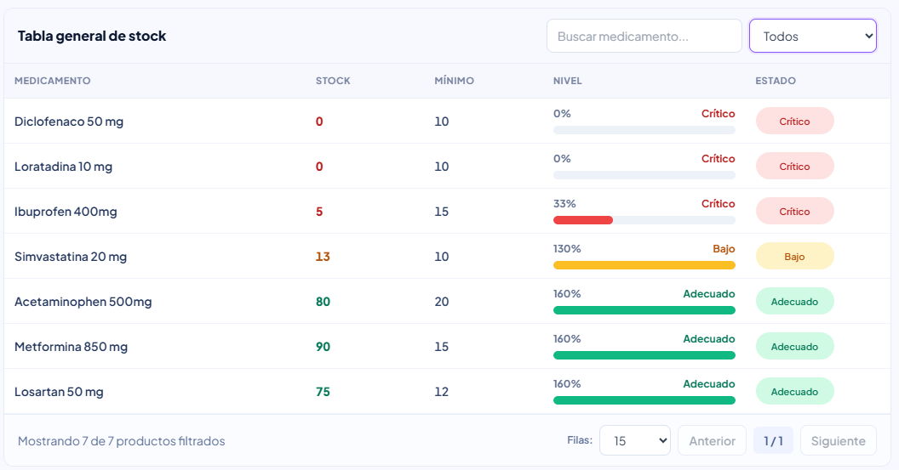
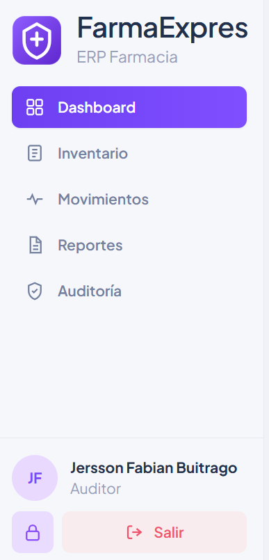

# HU-QA-NTM-15 - Control Inteligente de Stock

## 1. Historia de Usuario

### 1.1 Identificación

- **Título:** Frontend - Control Inteligente de Stock
- **ID:** HU-15-NTM
- **Relacionado:** HU-14-NTM, HU-FE-09, HU-FE-10, HU-FE-11
- **Prioridad:** Must Have (Alta)

### 1.2 Descripción

Como **Administrador o Farmacéutico**,
quiero **visualizar el estado del inventario mediante un panel de control**,
para **identificar productos críticos y tomar decisiones de reposición**.

### 1.3 Justificación

El sistema requiere una vista operativa de solo lectura que permita revisar rápidamente el estado del inventario sin modificar medicamentos ni movimientos. Esta HU centraliza indicadores, productos críticos y una tabla general de niveles de stock para apoyar decisiones de reposición.

El módulo debe estar disponible para:

- **Administrador**, como responsable general del inventario.
- **Farmacéutico**, como operador de entradas y salidas.

El rol **Auditor** conserva sus vistas de consulta existentes, como Dashboard, Inventario, Movimientos y Reportes, pero no accede al módulo operativo **Control de stock**.

### 1.4 Criterios de Aceptación

#### Acceso

- [x] El módulo **Control de stock** aparece en el panel lateral para Administrador.
- [x] El módulo **Control de stock** aparece en el panel lateral para Farmacéutico.
- [x] El módulo **Control de stock** no aparece en el panel lateral para Auditor.
- [x] El acceso por URL `/stock` está restringido para Auditor.

#### Indicadores

- [x] Se muestran productos críticos.
- [x] Se muestra stock adecuado.
- [x] Se muestra total de unidades.
- [x] Los indicadores usan colores rojo, verde y neutro.

#### Productos críticos

- [x] Se listan productos bajo el mínimo.
- [x] Cada producto muestra nombre.
- [x] Cada producto muestra stock actual.
- [x] Cada producto muestra stock mínimo.
- [x] Cada producto muestra nivel en porcentaje.
- [x] Cada producto muestra sugerencia de reposición.

#### Tabla general

- [x] Existe tabla con medicamento, stock, mínimo, nivel y estado.
- [x] Los estados disponibles son Crítico, Bajo y Adecuado.
- [x] Se usan barras visuales de nivel.

### 1.5 Checklist QA

- [x] Visible para Administrador.
- [x] Visible para Farmacéutico.
- [x] Oculto para Auditor.
- [x] Indicadores correctos.
- [x] Productos críticos correctos.
- [x] Niveles y estados coherentes.
- [x] `npm run lint` pasa correctamente.
- [x] Validación funcional y QA aprobadas.

### 1.5.1 Estado implementado en frontend

- Se creó el módulo `frontend/src/stock/`.
- Se agregó la página **Control de stock** como vista de solo lectura.
- Se conectó la ruta protegida `/stock`.
- Se restringió el acceso del rol Auditor al nuevo módulo.
- Se conservaron los usos existentes de stock en Dashboard e Inventario para Auditor.
- Se agregaron alias de rol `PHARMACIST` y `ROLE_PHARMACIST` para normalizar respuestas del backend.
- Se agregó distribución visual por estado del inventario.
- Se agregaron filtros por estado, búsqueda por medicamento y paginación en la tabla general.

### 1.6 Cómo se implementó

- Se agregó una regla de acceso `canAccessStockControl`.
- Se reemplazó el placeholder de `/stock` por la vista funcional `StockControlPage`.
- Se creó el servicio `stock.service.js` para consultar:
  - `/api/inventory/stock-summary`
  - `/api/inventory/critical-products`
- Se dejaron rutas alternativas sin prefijo `/api` por compatibilidad con el endpoint sugerido.
- Se usa el inventario de medicamentos como respaldo cuando los endpoints nuevos aún no están disponibles.
- Se normalizan nombres de campos en español e inglés para tolerar variaciones de respuesta del backend.
- Se calculan porcentajes de distribución y faltantes de reposición desde los productos normalizados.

### 1.7 Qué se modificó

- `frontend/src/App.jsx`
  - Ruta `/stock` protegida por rol.
  - Renderizado del módulo **Control de stock**.

- `frontend/src/shared/constants/roles.js`
  - Nueva regla `canAccessStockControl`.
  - Alias de rol para `PHARMACIST`.

- `frontend/src/stock/services/stock.service.js`
  - Servicio de consulta y normalización de resumen, críticos y tabla general.

- `frontend/src/stock/pages/StockControlPage.jsx`
  - Vista de indicadores, distribución por estado, productos críticos, filtros y tabla general con barras de nivel.

### 1.8 Notas técnicas

- El módulo es de solo lectura.
- La validación de acceso frontend permite `ADMIN`, `ADMINISTRADOR`, `FARMACEUTICO`, `FARMACÉUTICO` y `PHARMACIST`.
- El rol Auditor no ve ni accede a `/stock`.
- El Dashboard del Auditor conserva su comportamiento: el KPI de unidades en stock redirige a Inventario, no al nuevo módulo.
- Los estados visuales se calculan como:
  - **Crítico:** stock actual menor al mínimo.
  - **Bajo:** stock actual menor a 1.5 veces el mínimo.
  - **Adecuado:** stock actual igual o superior al umbral bajo.

### 1.9 Flujo de usuario

1. El usuario inicia sesión.
2. El sistema identifica si su rol es Administrador o Farmacéutico.
3. El usuario accede a **Control de stock** desde el panel lateral.
4. El sistema muestra indicadores generales.
5. El usuario revisa productos críticos y sugerencias de reposición.
6. El usuario analiza niveles de stock en la tabla general.

---

## 2. Casos de Prueba Propuestos (HU-15-NTM)

> Ruta de evidencias: `doc/images/HU-15-NTM/`

### CP-HU-15-NTM-01 - Acceso a Control de stock Administrador

- **Objetivo:** Validar que el rol Administrador visualiza el módulo Control de stock en el panel lateral.
- **Acción ejecutada:** Iniciar sesión como Administrador y revisar el panel lateral.
- **Resultado esperado:** La opción **Control de stock** aparece disponible.
- **Evidencia:**

### CP-HU-15-NTM-02 - Indicadores de stock Administrador

- **Objetivo:** Validar los indicadores del panel de control para Administrador.
- **Acción ejecutada:** Ingresar a `/stock` como Administrador.
- **Resultado esperado:** Se visualizan productos críticos, stock adecuado y total de unidades con colores diferenciados.
- **Evidencia:**

### CP-HU-15-NTM-03 - Acceso a Control de stock Farmacéutico

- **Objetivo:** Validar que el rol Farmacéutico visualiza el módulo Control de stock.
- **Acción ejecutada:** Iniciar sesión como Farmacéutico y revisar el panel lateral.
- **Resultado esperado:** La opción **Control de stock** aparece disponible.
- **Evidencia:**

### CP-HU-15-NTM-04 - Productos críticos y sugerencia de reposición

- **Objetivo:** Validar el listado de productos bajo el mínimo.
- **Acción ejecutada:** Ingresar a Control de stock y revisar el bloque de productos críticos.
- **Resultado esperado:** Cada producto crítico muestra nombre, stock actual, mínimo, nivel y sugerencia de reposición.
- **Evidencia:**

### CP-HU-15-NTM-05 - Tabla general de niveles

- **Objetivo:** Validar la tabla general del módulo.
- **Acción ejecutada:** Revisar la tabla general de stock.
- **Resultado esperado:** La tabla muestra medicamento, stock, mínimo, nivel con barra visual y estado Crítico, Bajo o Adecuado.
- **Evidencia:**

### CP-HU-15-NTM-06 - Restricción Auditor

- **Objetivo:** Validar que Auditor no accede al módulo Control de stock.
- **Acción ejecutada:** Iniciar sesión como Auditor y revisar el panel lateral; luego intentar acceder a `/stock`.
- **Resultado esperado:** El módulo no aparece en el panel lateral y la URL redirige a la ruta permitida por defecto.
- **Evidencia:**

---

## 3. Conclusiones esperadas

- La HU-15-NTM habilita una vista de control inteligente de stock para Administrador y Farmacéutico.
- El módulo permite identificar productos críticos y niveles de reposición.
- La tabla general permite comparar stock actual contra mínimo definido.
- El rol Auditor conserva sus vistas existentes, pero no accede al nuevo módulo operativo.
- Estado final esperado: **QA aprobada**.
