# HU-QA-NTM-16 - Módulo de Auditoría

## 1. Historia de Usuario

### 1.1 Identificación

- **Título:** Frontend - Módulo de Auditoría
- **ID:** HU-16-NTM
- **Relacionado:** HU-FE-07, HU-FE-08, HU-FE-12, HU-15-NTM
- **Prioridad:** Must Have (Alta)
- **Rol principal:** Auditor
- **Estado:** Implementado e integrado con microservicio de auditoría

### 1.2 Descripción

Como **Auditor**,
quiero **visualizar el módulo de auditoría con historial, inconsistencias, observaciones y métricas**,
para **supervisar movimientos del sistema y detectar posibles irregularidades**.

### 1.3 Justificación

El sistema requiere una vista especializada para auditoría operativa de inventario. Esta HU permite que el Auditor revise entradas y salidas, identifique movimientos inusuales, documente observaciones y gestione casos de revisión sin modificar directamente el inventario.

La auditoría debe ayudar a responder preguntas como:

- qué movimientos se realizaron;
- quién los registró;
- cuándo ocurrieron;
- qué medicamento y cantidad se afectó;
- cuáles movimientos fueron marcados automáticamente por regla;
- cuáles fueron marcados manualmente por el Auditor;
- qué nota o conclusión tiene cada caso.

### 1.4 Criterios de Aceptación

#### Acceso

- [x] El módulo **Auditoría** aparece en el panel lateral para Auditor.
- [x] El módulo **Auditoría** no aparece para Administrador.
- [x] El módulo **Auditoría** no aparece para Farmacéutico.
- [x] El acceso por URL `/audit` está restringido para roles no autorizados.

#### Historial

- [x] Existe pestaña **Historial**.
- [x] Se muestra tabla de movimientos auditables.
- [x] Cada movimiento muestra:
  - movimiento;
  - fecha;
  - tipo;
  - medicamento;
  - cantidad;
  - responsable;
  - motivo;
  - estado;
  - acciones.
- [x] Existe buscador de movimientos.
- [x] Existe paginación por cantidad de filas.
- [x] Existe opción de exportar.
- [x] El Auditor puede marcar manualmente un movimiento.
- [x] La marcación manual exige una nota obligatoria.
- [x] Desde Historial se puede ver la nota del caso.

#### Inconsistencias

- [x] Existe pestaña **Inconsistencias**.
- [x] Se muestran casos de revisión generados por auditoría.
- [x] Se diferencian inconsistencias **Automáticas** y **Manuales**.
- [x] Las inconsistencias automáticas se generan por reglas del microservicio.
- [x] Las inconsistencias manuales nacen desde una nota del Auditor.
- [x] Cada caso muestra:
  - movimiento;
  - medicamento;
  - cantidad;
  - usuario;
  - origen;
  - seguimiento.
- [x] El texto técnico de la regla automática queda en la nota del caso, no como texto largo en la tabla.
- [x] Se puede iniciar revisión, marcar revisado, cerrar caso y editar nota.
- [x] Las acciones de seguimiento solicitan nota para dejar trazabilidad.

#### Observaciones

- [x] Existe pestaña **Observaciones**.
- [x] El Auditor puede visualizar observaciones registradas.
- [x] Cada observación muestra:
  - prioridad;
  - movimiento relacionado;
  - tipo de movimiento;
  - medicamento;
  - cantidad;
  - motivo;
  - fecha;
  - descripción;
  - usuario relacionado;
  - usuario que registró la observación.
- [x] Las observaciones se agrupan por caso/movimiento para evitar duplicados visuales innecesarios.
- [x] Se pueden filtrar observaciones por estado, texto y fechas.
- [x] Existe opción de exportar observaciones filtradas en Excel.

#### Métricas

- [x] Existe pestaña **Métricas**.
- [x] Se muestran métricas generales de auditoría.
- [x] Se muestra actividad por usuario.
- [x] Se muestran medicamentos más movidos.
- [x] Se muestran indicadores generales:
  - total movimientos;
  - marcados;
  - observaciones;
  - usuarios.

#### Reglas automáticas

- [x] El sistema detecta entradas/salidas inusuales por cantidad según patrón del medicamento.
- [x] Si existe historial suficiente, se evalúa contra el patrón histórico del mismo medicamento y tipo de movimiento.
- [x] Si existe poco historial, se aplica una regla inicial conservadora para cantidades altas.
- [x] Las razones generadas automáticamente se guardan como nota/observación del caso.
- [x] El historial refleja el estado actualizado del movimiento: Normal, Marcado, En revisión, Revisado o Cerrado.

### 1.5 Checklist QA

- [x] Visible solo para Auditor.
- [x] Oculto para Administrador y Farmacéutico.
- [x] Restricción correcta por URL.
- [x] Historial carga correctamente desde `audit-service`.
- [x] Inconsistencias visibles correctamente.
- [x] Observaciones visibles correctamente.
- [x] Métricas renderizan correctamente.
- [x] Marcación manual exige nota.
- [x] Nota manual queda visible en observaciones.
- [x] Caso automático crea nota del sistema.
- [x] Reglas automáticas detectan cantidades inusuales.
- [x] Exportación de observaciones filtradas funciona.
- [x] `npm run lint` pasa correctamente.
- [x] `npm run build` pasa correctamente.
- [x] `audit-service` compila correctamente.

### 1.5.1 Estado implementado

- Se creó el módulo frontend `frontend/src/audit/`.
- Se agregó ruta protegida `/audit`.
- Se agregó control de acceso por rol Auditor.
- Se integró el frontend con el microservicio `audit-service`.
- Se implementaron pestañas de Historial, Inconsistencias, Observaciones y Métricas.
- Se agregó paginación en tablas/listados extensos.
- Se normalizaron usuarios de sistema para mostrar **Sistema**.
- Se agregó exportación de observaciones filtradas en Excel.
- Se ajustó la lógica para que la razón automática se registre como nota.
- Se ajustó la regla automática para detectar cantidades altas incluso con poco historial.
- Se sincroniza el estado de auditoría con el historial de movimientos.

### 1.6 Cómo se implementó

#### Frontend

El módulo consume los endpoints del microservicio de auditoría mediante `audit.service.js`.

Se normalizan respuestas para tolerar nombres de campos del backend y mantener la interfaz estable.

El frontend muestra:

- historial de movimientos;
- casos de revisión;
- observaciones;
- métricas de auditoría.

Las acciones principales son:

- marcar movimiento con nota obligatoria;
- consultar nota desde historial;
- iniciar revisión;
- marcar revisado;
- cerrar caso;
- editar nota;
- exportar observaciones filtradas.

#### Backend

El microservicio `audit-service` centraliza la auditoría:

- consulta movimientos del `inventory-service`;
- crea casos automáticos cuando detecta patrones inusuales;
- crea casos manuales desde acciones del Auditor;
- registra observaciones asociadas al caso;
- actualiza el estado de auditoría del movimiento en inventario;
- expone métricas para el frontend.

#### Reglas automáticas

La regla de cantidad alta funciona en dos escenarios:

- **Historial suficiente:** compara contra la mediana histórica del mismo medicamento y mismo tipo de movimiento.
- **Poco historial:** usa un umbral inicial para detectar cantidades claramente altas sin esperar a que existan muchos datos.

Ejemplo validado:

- Movimiento `25`, Diclofenaco 50 mg, entrada de `200` unidades:
  - estado: `MARCADO`;
  - origen: `AUTO`;
  - prioridad: `HIGH`;
  - nota: `Cantidad alta para un medicamento con poco historial comparable`.

Ejemplo validado:

- Movimiento `26`, Metformina 850 mg, entrada de `250` unidades:
  - estado: `MARCADO`;
  - origen: `AUTO`;
  - prioridad: `HIGH`;
  - nota: `Cantidad alta para un medicamento con poco historial comparable`.

### 1.7 Qué se modificó

#### Frontend

- `frontend/src/App.jsx`
  - Ruta `/audit` protegida por rol.

- `frontend/src/shared/constants/roles.js`
  - Regla de acceso para Auditoría.

- `frontend/src/audit/pages/AuditPage.jsx`
  - Interfaz completa del módulo.
  - Historial, inconsistencias, observaciones y métricas.
  - Modales de nota.
  - Paginación y filtros.
  - Acciones de seguimiento.

- `frontend/src/audit/services/audit.service.js`
  - Consumo de endpoints de auditoría.
  - Normalización de historial, inconsistencias, observaciones y métricas.
  - Reintentos ante indisponibilidad temporal del `audit-service`.

- `frontend/src/audit/utils/auditExport.utils.js`
  - Exportación de observaciones filtradas.

#### Backend relacionado

- `audit-service`
  - Microservicio de auditoría.
  - Entidades de casos, reglas y observaciones.
  - Endpoints REST para historial, inconsistencias, observaciones, métricas, notas y estados.

- `audit-service/src/main/java/co/edu/corhuila/audit_service/Service/AuditRuleEngine.java`
  - Reglas automáticas de detección.

- `audit-service/src/main/java/co/edu/corhuila/audit_service/Service/AuditService.java`
  - Creación de casos automáticos/manuales.
  - Creación de observaciones automáticas.
  - Sincronización de estado con inventario.

- `api-gateway`
  - Ruta `/api/audit/**` hacia `audit-service`.

- `inventory-service`
  - Estado de auditoría visible en movimientos.
  - Endpoint para actualizar estado de auditoría de un movimiento.

### 1.8 Endpoints usados

- `GET /api/audit/history`
- `GET /api/audit/inconsistencies`
- `GET /api/audit/observations`
- `GET /api/audit/metrics`
- `POST /api/audit/recalculate`
- `POST /api/audit/cases/manual`
- `PATCH /api/audit/cases/{id}/note`
- `PATCH /api/audit/cases/{id}/status`
- `DELETE /api/audit/cases/{id}/manual-flag`

### 1.9 Notas técnicas

- El módulo es de consulta y seguimiento, no modifica inventario directamente.
- La marcación manual exige nota para trazabilidad.
- Las observaciones son la fuente visual del porqué se marcó o cerró un caso.
- La tabla de inconsistencias muestra el origen del caso y evita mostrar textos largos de reglas.
- Las exportaciones deben respetar los filtros aplicados.
- El `audit-service` debe estar saludable para que el módulo cargue datos reales.
- Si el gateway queda temporalmente en fallback después de reiniciar servicios, se debe esperar healthcheck o reiniciar `api-gateway`.
- Recomendación futura: disparar auditoría automáticamente desde `inventory-service` al crear cada movimiento, para no depender de recalcular al entrar al módulo.

### 1.10 Flujo de usuario

1. El usuario Auditor inicia sesión.
2. El sistema muestra **Auditoría** en el panel lateral.
3. El Auditor ingresa al módulo.
4. El sistema carga/recalcula auditoría.
5. El Auditor consulta el historial de movimientos.
6. El sistema muestra casos automáticos y manuales.
7. El Auditor revisa inconsistencias.
8. El Auditor registra o edita notas.
9. El Auditor inicia revisión, marca revisado o cierra casos.
10. El Auditor consulta observaciones y métricas.
11. El Auditor exporta observaciones filtradas si lo requiere.

---

## 2. Casos de Prueba Propuestos (HU-16-NTM)

> Ruta de evidencias: `doc/images/HU-16-NTM/`

### CP-HU-16-NTM-01 - Acceso Auditor

- **Objetivo:** Validar que el rol Auditor visualiza el módulo Auditoría.
- **Acción ejecutada:** Iniciar sesión como Auditor y revisar el panel lateral.
- **Resultado esperado:** La opción **Auditoría** aparece disponible.
- **Evidencia:**

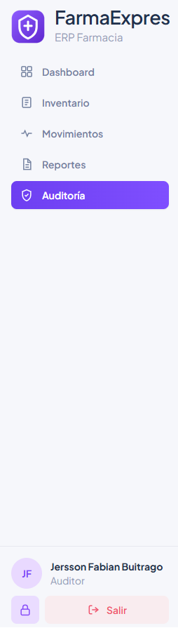

### CP-HU-16-NTM-02 - Restricción Administrador y Farmacéutico

- **Objetivo:** Validar que roles no autorizados no visualizan Auditoría.
- **Acción ejecutada:** Iniciar sesión como Administrador y Farmacéutico; revisar panel lateral e intentar acceder a `/audit`.
- **Resultado esperado:** Auditoría no aparece y el acceso por URL se restringe.
- **Evidencia:**

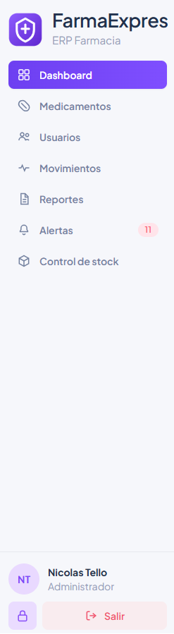

### CP-HU-16-NTM-03 - Historial de auditoría

- **Objetivo:** Validar que el historial carga movimientos auditables.
- **Acción ejecutada:** Ingresar a Auditoría en la pestaña Historial.
- **Resultado esperado:** Se muestran movimientos con medicamento, cantidad, responsable, motivo, estado y acciones.
- **Evidencia:**

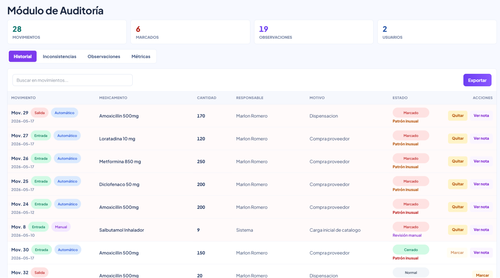

### CP-HU-16-NTM-04 - Marcación manual con nota obligatoria

- **Objetivo:** Validar que el Auditor debe registrar una nota al marcar un movimiento.
- **Acción ejecutada:** Seleccionar **Marcar** en un movimiento normal y guardar nota.
- **Resultado esperado:** El movimiento queda marcado manualmente y la nota se asocia al caso.
- **Evidencia:**

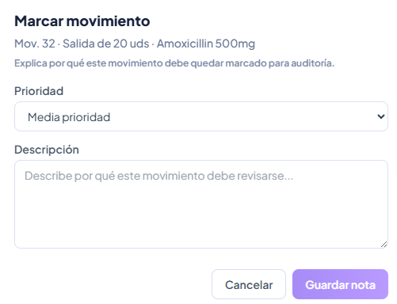

### CP-HU-16-NTM-05 - Inconsistencia automática por cantidad alta

- **Objetivo:** Validar detección automática de una entrada inusual.
- **Acción ejecutada:** Registrar una entrada alta, por ejemplo Diclofenaco 50 mg con 200 unidades o Metformina 850 mg con 250 unidades.
- **Resultado esperado:** El movimiento queda marcado como Automático y el detalle de la regla queda en la nota.
- **Evidencia:**

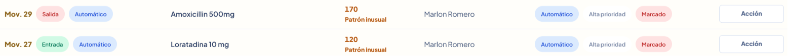

### CP-HU-16-NTM-06 - Inconsistencias con origen claro

- **Objetivo:** Validar que la tabla de inconsistencias no muestra textos largos de regla.
- **Acción ejecutada:** Abrir pestaña Inconsistencias.
- **Resultado esperado:** La tabla muestra origen **Automático** o **Manual**, prioridad, estado y seguimiento.
- **Evidencia:**

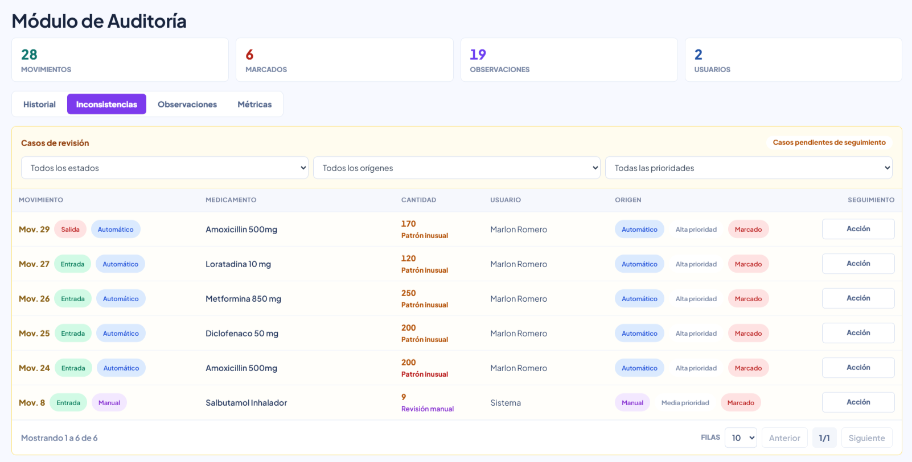

### CP-HU-16-NTM-07 - Seguimiento de caso

- **Objetivo:** Validar acciones del caso de revisión.
- **Acción ejecutada:** Iniciar revisión, marcar revisado o cerrar caso agregando nota.
- **Resultado esperado:** El estado del caso cambia correctamente y queda trazabilidad en observaciones.
- **Evidencia:**

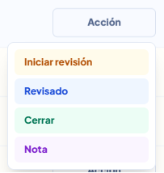

### CP-HU-16-NTM-08 - Observaciones registradas

- **Objetivo:** Validar que las observaciones muestran información suficiente del movimiento.
- **Acción ejecutada:** Abrir pestaña Observaciones.
- **Resultado esperado:** Cada observación muestra medicamento, cantidad, motivo, fecha, prioridad, estado, usuario y descripción.
- **Evidencia:**

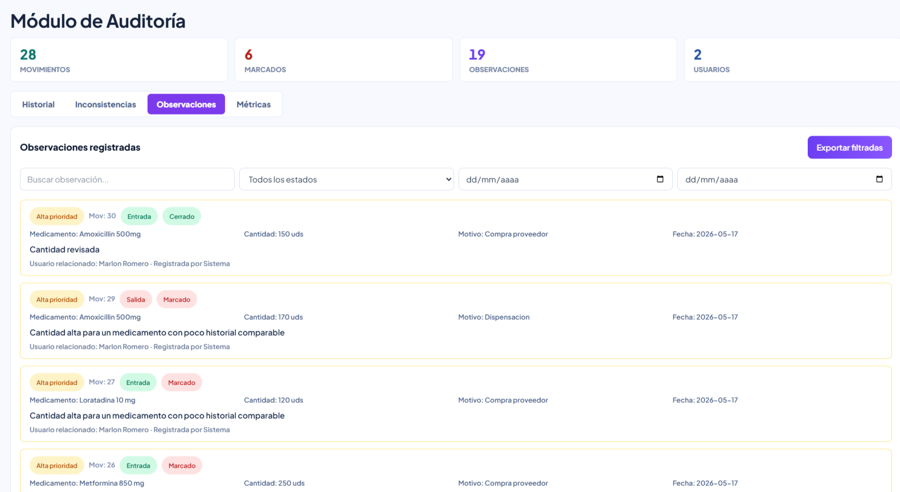

### CP-HU-16-NTM-09 - Filtros y exportación de observaciones

- **Objetivo:** Validar exportación controlada de observaciones.
- **Acción ejecutada:** Aplicar filtros por estado/texto/fecha y exportar.
- **Resultado esperado:** Se genera archivo Excel con las observaciones filtradas.
- **Evidencia:**

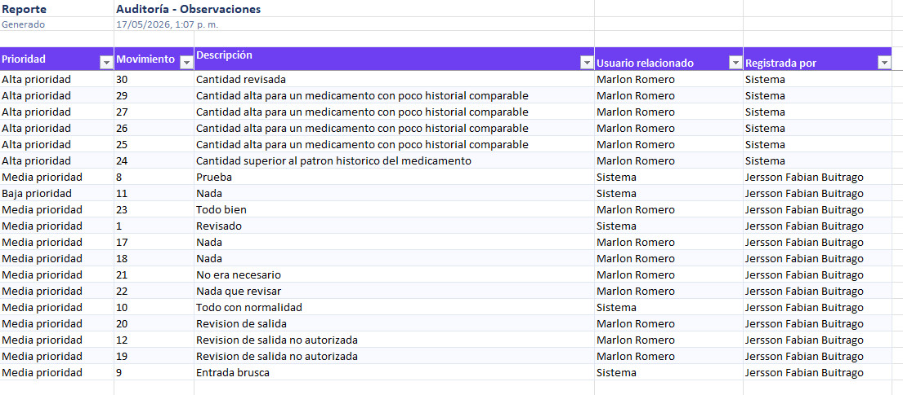

### CP-HU-16-NTM-10 - Métricas de auditoría

- **Objetivo:** Validar indicadores y métricas del módulo.
- **Acción ejecutada:** Abrir pestaña Métricas.
- **Resultado esperado:** Se muestran movimientos, marcados, observaciones, usuarios y actividad relevante.
- **Evidencia:**

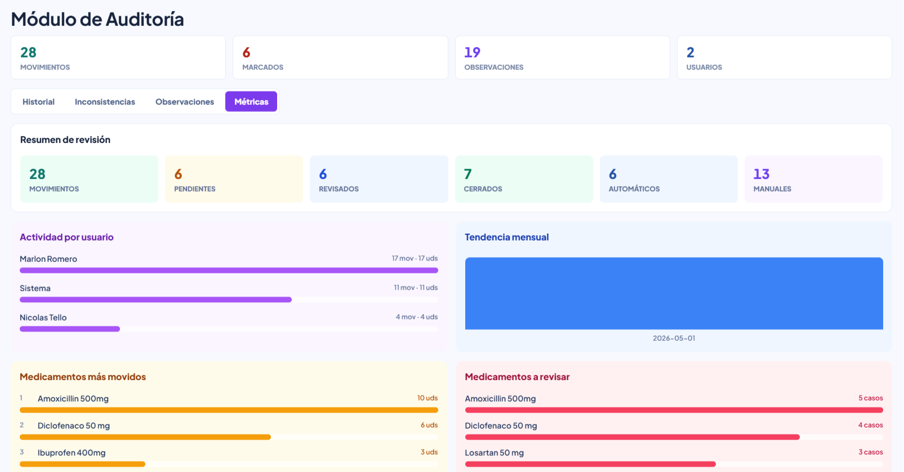

### CP-HU-16-NTM-11 - Estado reflejado en Movimientos

- **Objetivo:** Validar que el estado de auditoría se refleja en el historial de movimientos.
- **Acción ejecutada:** Marcar o cerrar un caso desde Auditoría y revisar el módulo Movimientos.
- **Resultado esperado:** El movimiento muestra el estado correspondiente: Marcado, Revisado o Cerrado.
- **Evidencia:**

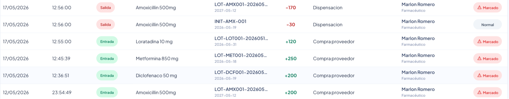

---

## 3. Validaciones técnicas ejecutadas

```bash
npm run lint
npm run build
```

Resultado esperado:

- `lint` sin errores.
- `build` correcto.

Validación backend relacionada:

```bash
./mvnw.cmd -q package -DskipTests
```

Resultado esperado:

- `audit-service` compila correctamente.

Validación API:

- `GET /api/audit/history`
- `GET /api/audit/inconsistencies`
- `GET /api/audit/observations`
- `POST /api/audit/recalculate`

Resultado esperado:

- Respuestas `200 OK`.
- Movimientos automáticos aparecen marcados.
- Observaciones automáticas quedan registradas.

---

## 4. Evidencias anexadas

Las evidencias fueron guardadas en:

`doc/images/HU-16-NTM/`

Las imágenes están anexadas en cada caso de prueba de la sección **2. Casos de Prueba Propuestos (HU-16-NTM)**.

---

## 5. Conclusiones esperadas

- La HU-16-NTM habilita un módulo real de auditoría para el rol Auditor.
- El Auditor puede consultar historial, inconsistencias, observaciones y métricas.
- El sistema puede marcar casos automáticos por patrones inusuales.
- El Auditor puede marcar casos manualmente con nota obligatoria.
- Las observaciones centralizan la trazabilidad del caso.
- El estado de auditoría se refleja en movimientos.
- Estado final esperado: **QA aprobada**.
